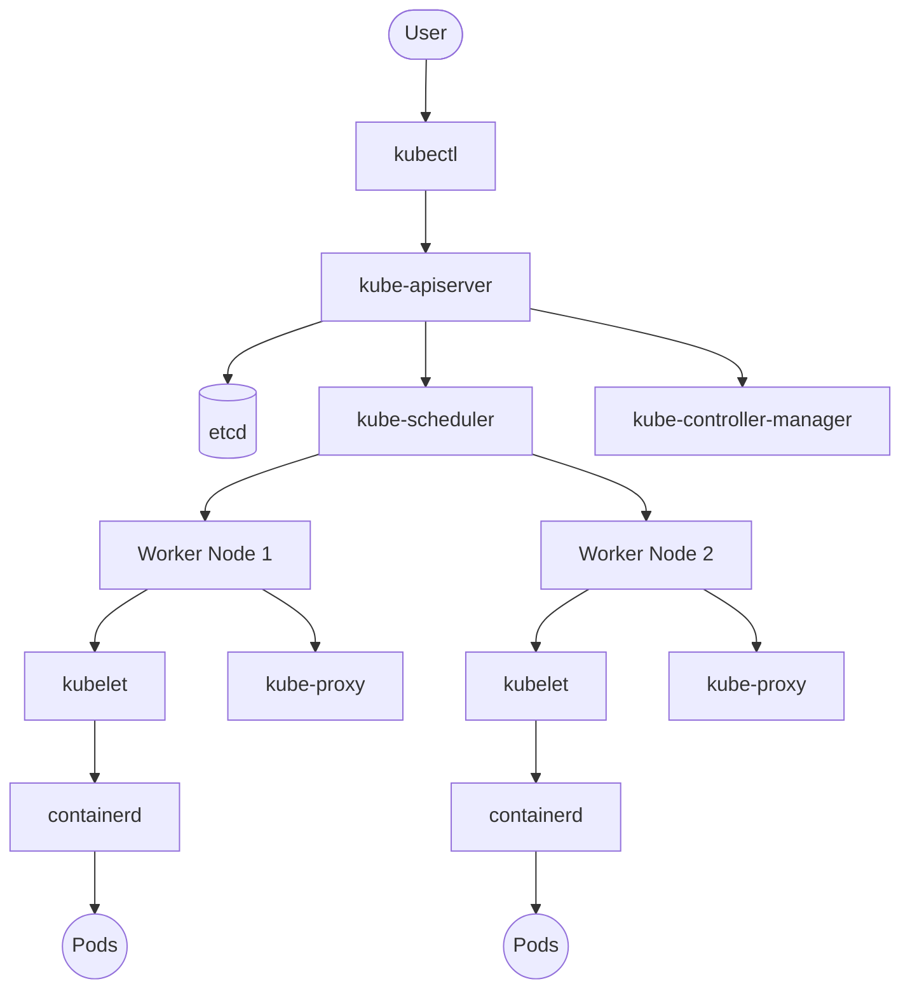

# Kubernetes Cluster Architecture

## High-Level Architecture
# Kubernetes Cluster Architecture

---

## Component Summary

| Component | Responsibility |
|-----------|----------------|
| kube-apiserver | Entry point to the Kubernetes API |
| etcd | Stores cluster state |
| kube-scheduler | Assigns Pods to Worker Nodes |
| kube-controller-manager | Maintains desired state |
| kubelet | Runs and monitors Pods |
| kube-proxy | Manages Service networking |
| Container Runtime | Runs containers |

---

## Production Notes

In managed Kubernetes services such as Amazon EKS, Azure AKS, and Google GKE:

- The cloud provider manages the Control Plane.
- Customers primarily manage Worker Nodes and workloads.
- etcd backups are handled by the cloud provider.
- Direct access to Control Plane nodes is generally not available.
