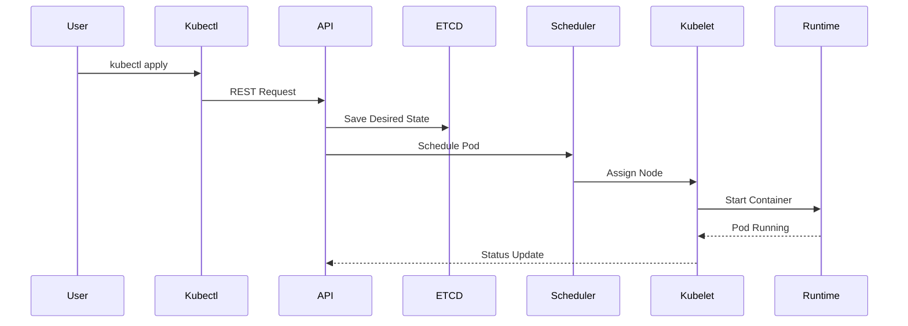

# Pod Creation Workflow

## End-to-End Request Flow

---

## Workflow

1. User submits a request using `kubectl`.
2. The API Server authenticates and authorizes the request.
3. Admission Controllers validate or mutate the request.
4. The desired state is stored in etcd.
5. The Deployment Controller creates a ReplicaSet.
6. The Scheduler selects the most appropriate Worker Node.
7. kubelet receives the Pod specification.
8. The container runtime pulls the container image.
9. The Pod starts running.
10. kubelet reports the Pod status back to the API Server.
