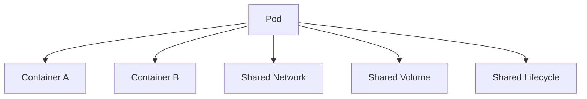
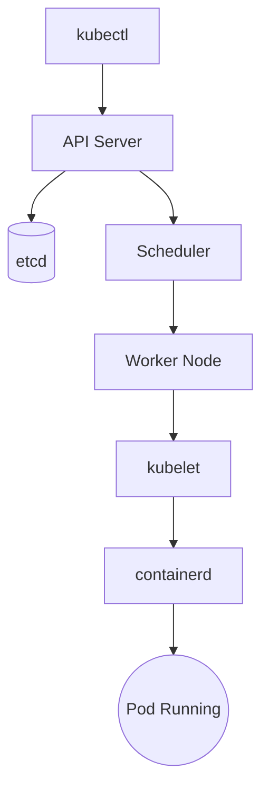

# Pods - Cheat Sheet

> **Quick Revision Guide for the CKA Exam**

---

# What is a Pod?

✅ Smallest deployable unit in Kubernetes.

A Pod contains:

- One or more containers
- Shared network
- Shared storage
- Shared lifecycle

---

# Pod Architecture



---

# Pod Lifecycle

| Phase | Description |
|---------|-------------|
| Pending | Pod accepted but not running |
| Running | At least one container running |
| Succeeded | All containers exited successfully |
| Failed | One or more containers failed |
| Unknown | State cannot be determined |

---

# Container States

| State | Meaning |
|---------|----------|
| Waiting | Container not started |
| Running | Container executing |
| Terminated | Container stopped |

---

# Common Pod Problems

| Status | Meaning |
|----------|------------------------------|
| CrashLoopBackOff | Application repeatedly crashes |
| ImagePullBackOff | Image cannot be downloaded |
| ErrImagePull | Image pull failed |
| OOMKilled | Container exceeded memory limit |
| ContainerCreating | Container still starting |
| Pending | Scheduler cannot place Pod |

---

# Restart Policies

| Policy | Description |
|----------|-------------|
| Always | Default for Deployments |
| OnFailure | Restart only after failures |
| Never | Never restart |

---

# QoS Classes

| Class | Description |
|--------|-------------|
| Guaranteed | Requests = Limits |
| Burstable | Requests < Limits |
| BestEffort | No requests or limits |

---

# Resource Units

CPU

```text
1000m = 1 CPU
500m = 0.5 CPU
250m = 0.25 CPU
```

Memory

```text
128Mi
256Mi
512Mi
1Gi
2Gi
```

---

# Pod Creation Flow



---

# Must Know Commands

```bash
kubectl get pods

kubectl get pods -o wide

kubectl describe pod nginx

kubectl logs nginx

kubectl logs -f nginx

kubectl logs nginx --previous

kubectl exec -it nginx -- bash

kubectl exec -it nginx -- sh

kubectl delete pod nginx

kubectl get events

kubectl top pod

kubectl top node

kubectl explain pod
```

---

# Pod YAML Skeleton

```yaml
apiVersion: v1
kind: Pod
metadata:
  name: nginx
spec:
  containers:
    - name: nginx
      image: nginx
      ports:
        - containerPort: 80
```

---

# Production Best Practices

✅ One primary application per Pod

✅ Configure CPU & Memory Requests

✅ Configure Limits

✅ Use Health Probes

✅ Use Secrets

✅ Avoid latest image tag

✅ Keep Pods stateless

---

# CKA Memory Tricks

Scheduler
→ Chooses Node

kubelet
→ Runs Pod

kube-proxy
→ Networking

etcd
→ Cluster Database

API Server
→ Entry Point

Controller Manager
→ Desired State

---

# Exam Tips

✔ Read the question completely before typing.

✔ Generate YAML using:

```bash
kubectl run nginx \
  --image=nginx \
  --dry-run=client \
  -o yaml
```

✔ Use:

```bash
kubectl explain pod.spec
```

when unsure of a field.

✔ Check events before troubleshooting logs.

✔ Save frequently during the exam.

---

# Quick Review Checklist

☐ Pod phases

☐ Restart Policies

☐ QoS Classes

☐ Resource Requests

☐ Resource Limits

☐ Logs

☐ Exec

☐ Describe

☐ Events

☐ YAML

☐ Common Errors
