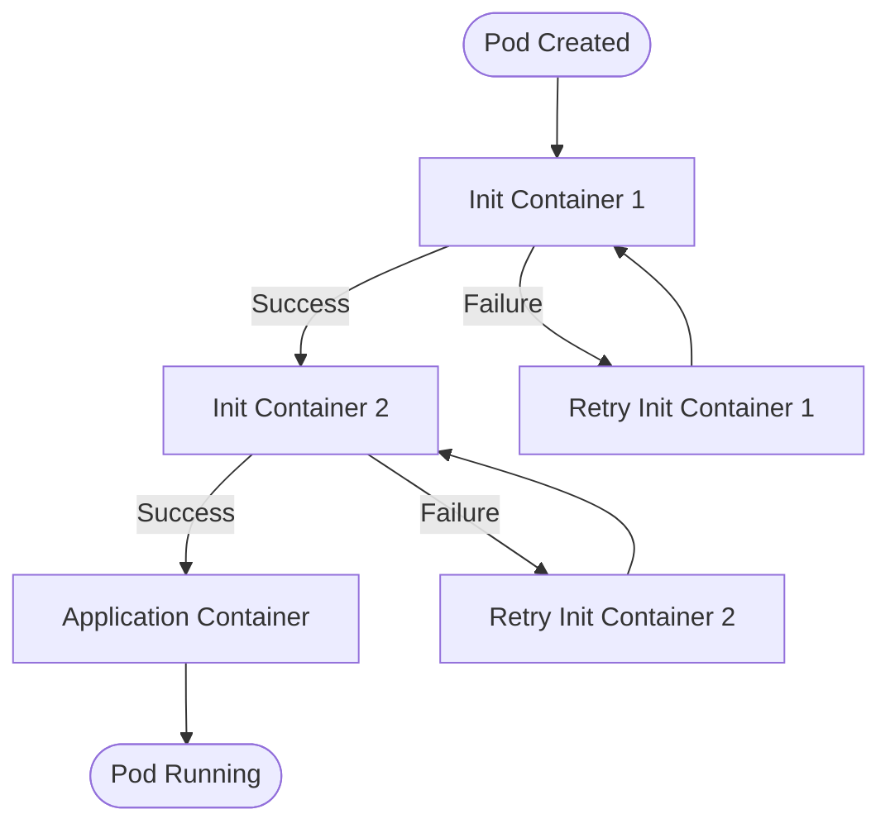

# Init Container Flow

```mermaid
flowchart TD
    Start([Pod Created])
    Init1[Init Container 1]
    Init2[Init Container 2]
    App[Application Container]
    Running([Pod Running])

    Start --> Init1
    Init1 -->|Success| Init2
    Init2 -->|Success| App
    App --> Running

    Init1 -->|Failure| Retry1[Retry Init Container 1]
    Retry1 --> Init1

    Init2 -->|Failure| Retry2[Retry Init Container 2]
    Retry2 --> Init2
```

## Key Point

Init Containers must complete successfully before application containers start.
