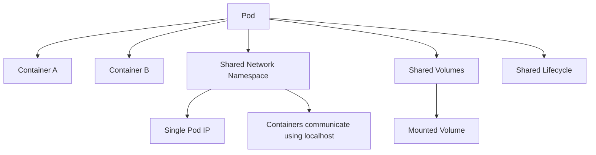

# Pod Architecture

```mermaid
flowchart TD
    Pod[Pod]

    Pod --> ContainerA[Container A]
    Pod --> ContainerB[Container B]
    Pod --> Network[Shared Network Namespace]
    Pod --> Storage[Shared Volumes]
    Pod --> Lifecycle[Shared Lifecycle]

    Network --> IP[Single Pod IP]
    Network --> Localhost[Containers communicate using localhost]
    Storage --> Volume[Mounted Volume]
```

## Key Point

Containers inside the same Pod share networking and storage.
