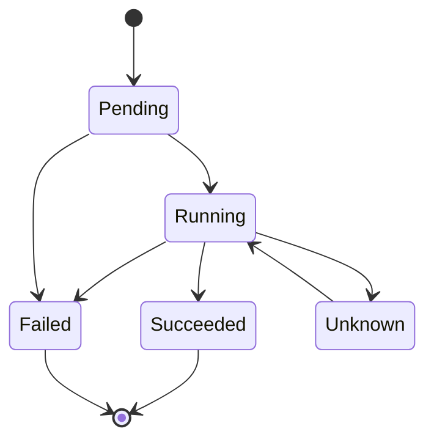

# Pod Lifecycle

## Pod Phases

| Phase | Meaning |
|---|---|
| Pending | Pod accepted but not running |
| Running | At least one container is running |
| Succeeded | All containers exited successfully |
| Failed | One or more containers failed |
| Unknown | Pod state cannot be determined |
