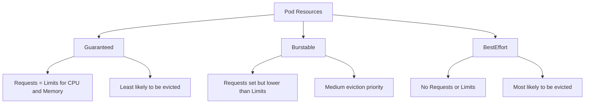

# Kubernetes QoS Classes

## Summary

| QoS Class | Condition | Eviction Priority |
|---|---|---|
| Guaranteed | Requests equal limits | Lowest |
| Burstable | Requests lower than limits | Medium |
| BestEffort | No requests or limits | Highest |
