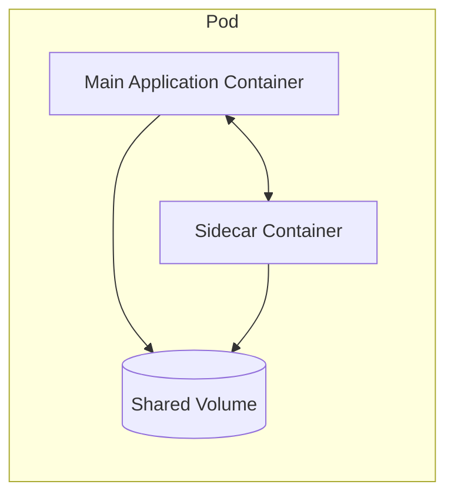

# Sidecar Pattern

```mermaid
flowchart LR
    subgraph Pod
        App[Main Application Container]
        Sidecar[Sidecar Container]
        Volume[(Shared Volume)]
    end

    App --> Volume
    Sidecar --> Volume
    App <--> Sidecar
```

## Common Sidecar Use Cases

- Log collection
- Monitoring agents
- Service mesh proxy
- Configuration reloaders
