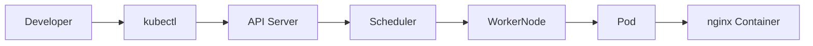

# Lab 01 - Creating Your First Pod

## Objective

In this lab, you will:

* Create a Pod using `kubectl run`
* Verify that the Pod is running
* Inspect the Pod
* View Pod logs
* Execute commands inside the Pod
* Delete the Pod

This lab introduces the basic Pod lifecycle and the most common `kubectl` commands used in daily Kubernetes administration.

---

# Prerequisites

* Kubernetes cluster (Kind, Minikube, or any Kubernetes cluster)
* `kubectl` configured
* Internet connectivity to pull the `nginx` image

Verify your cluster:

```bash
kubectl cluster-info
kubectl get nodes
```

---

# Architecture



---

# Step 1 - Verify the Cluster

```bash
kubectl cluster-info
kubectl get nodes
```

### Expected Result

* Kubernetes control plane is reachable.
* At least one node is in the `Ready` state.

---

# Step 2 - Create a Pod

```bash
kubectl run nginx --image=nginx
```

### Verify

```bash
kubectl get pods
```

Example output:

```text
NAME    READY   STATUS    RESTARTS   AGE
nginx   1/1     Running   0          20s
```

---

# Step 3 - View Detailed Pod Information

```bash
kubectl describe pod nginx
```

Observe the following sections:

* Node
* Labels
* Status
* IP Address
* Containers
* Conditions
* Events

---

# Step 4 - View Pod Logs

```bash
kubectl logs nginx
```

For an NGINX container, there may be little or no output until it receives traffic.

---

# Step 5 - Execute Commands Inside the Pod

Open a shell:

```bash
kubectl exec -it nginx -- /bin/bash
```

If `/bin/bash` is unavailable:

```bash
kubectl exec -it nginx -- /bin/sh
```

Inside the container, run:

```bash
hostname
ip addr
ls /
cat /etc/os-release
```

Exit the shell:

```bash
exit
```

---

# Step 6 - Port Forward the Pod

Forward local port 8080 to the Pod's port 80:

```bash
kubectl port-forward pod/nginx 8080:80
```

Open your browser:

```text
http://localhost:8080
```

You should see the default NGINX welcome page.

Stop port forwarding with:

```text
Ctrl + C
```

---

# Step 7 - Inspect Pod YAML

```bash
kubectl get pod nginx -o yaml
```

Identify:

* apiVersion
* kind
* metadata
* spec
* status

---

# Step 8 - Delete the Pod

```bash
kubectl delete pod nginx
```

Verify deletion:

```bash
kubectl get pods
```

The Pod should no longer be listed.

---

# Common Errors

## Pod Stuck in Pending

Check:

```bash
kubectl describe pod nginx
kubectl get events
```

Possible causes:

* Insufficient resources
* Unschedulable node
* Taints

---

## ImagePullBackOff

Possible causes:

* Incorrect image name
* Network issue
* Private registry authentication

Investigate:

```bash
kubectl describe pod nginx
```

---

# CKA Tips

* `kubectl describe pod` is often the fastest way to identify scheduling or startup issues.
* `kubectl get events --sort-by=.lastTimestamp` is invaluable for troubleshooting.
* Learn to read `kubectl get pods` output quickly.

---

# Production Notes

* Standalone Pods are useful for testing and debugging.
* Long-running production applications should typically be managed through a Deployment.
* Use labels consistently so Pods can be selected by Services and controllers.

---

# Cleanup

Verify no Pods remain:

```bash
kubectl get pods
```

Delete any remaining test Pods:

```bash
kubectl delete pod --all
```

---

# Challenge

Without using the notes:

1. Create a Pod named `redis`.
2. Use the `redis:7` image.
3. Verify it is running.
4. Display its YAML.
5. Open a shell inside the Pod.
6. Delete the Pod.

If you can complete all six tasks without looking up the commands, you've mastered the fundamentals of Pod creation.
