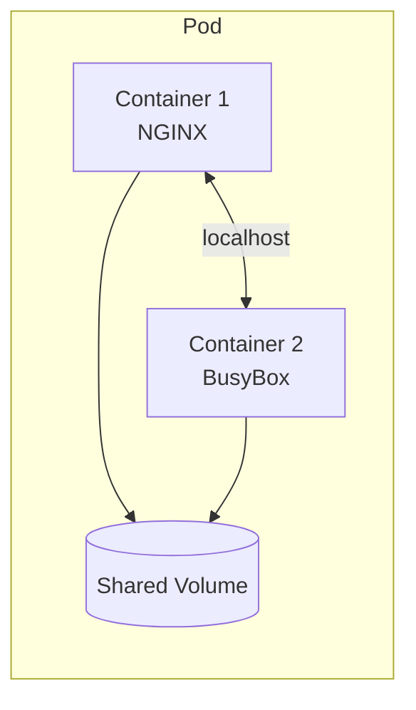

# Lab 02 - Multi-Container Pods

## Difficulty

⭐⭐ Intermediate

## Estimated Time

20–30 minutes

---

# Objective

In this lab, you will:

* Create a Pod with multiple containers.
* Understand how containers share networking.
* Understand how containers share storage.
* Verify inter-container communication.
* Learn when multi-container Pods should be used.

---

# Skills Covered

* Multi-container Pods
* Shared network namespace
* Shared volumes
* localhost communication
* Sidecar architecture fundamentals

---

# Prerequisites

* Kubernetes cluster
* kubectl configured
* Basic knowledge of Pods

Verify cluster connectivity:

```bash
kubectl cluster-info
kubectl get nodes
```

---

# Architecture



---

# Why Multi-Container Pods?

Containers in the same Pod are tightly coupled.

They:

* Start together
* Stop together
* Share one IP address
* Share localhost
* Can share volumes

Examples:

* Log collector sidecar
* Service mesh proxy (Istio Envoy)
* Monitoring agent
* Vault Agent
* Configuration reloader

---

# Step 1 - Create the Pod YAML

Create a file named:

```text
multi-container-pod.yaml
```

Paste the following YAML:

```yaml
apiVersion: v1
kind: Pod
metadata:
  name: multi-container-pod
spec:
  volumes:
    - name: shared-data
      emptyDir: {}

  containers:

    - name: nginx
      image: nginx

      volumeMounts:
        - name: shared-data
          mountPath: /usr/share/nginx/html

    - name: busybox
      image: busybox

      command:
        - sh
        - -c
        - |
          while true
          do
            date > /shared/index.html
            sleep 5
          done

      volumeMounts:
        - name: shared-data
          mountPath: /shared
```

---

# Step 2 - Create the Pod

```bash
kubectl apply -f multi-container-pod.yaml
```

Verify:

```bash
kubectl get pods
```

Expected output:

```text
NAME                   READY   STATUS
multi-container-pod    2/2     Running
```

Notice:

Both containers must be running.

---

# Step 3 - Describe the Pod

```bash
kubectl describe pod multi-container-pod
```

Observe:

* Two containers
* Shared volume
* Events
* Conditions

---

# Step 4 - View Logs

NGINX container:

```bash
kubectl logs multi-container-pod -c nginx
```

BusyBox container:

```bash
kubectl logs multi-container-pod -c busybox
```

Important:

When multiple containers exist, always specify the container using:

```bash
-c <container-name>
```

---

# Step 5 - Execute Commands

Enter BusyBox:

```bash
kubectl exec -it multi-container-pod -c busybox -- sh
```

Verify:

```bash
ls /shared

cat /shared/index.html
```

Exit:

```bash
exit
```

---

# Step 6 - Verify Shared Storage

Enter NGINX:

```bash
kubectl exec -it multi-container-pod -c nginx -- sh
```

Verify:

```bash
ls /usr/share/nginx/html

cat /usr/share/nginx/html/index.html
```

Notice:

The file written by BusyBox is immediately visible to NGINX.

This demonstrates the shared `emptyDir` volume.

---

# Step 7 - Verify localhost Communication

Port-forward the Pod:

```bash
kubectl port-forward pod/multi-container-pod 8080:80
```

Open:

```text
http://localhost:8080
```

Refresh every few seconds.

The displayed timestamp should update automatically because the BusyBox container continuously rewrites `index.html`.

---

# Verification Checklist

✅ Two containers running

✅ Shared volume working

✅ Shared localhost networking

✅ NGINX serving files written by BusyBox

---

# Common Errors

## One Container Not Running

Check:

```bash
kubectl describe pod multi-container-pod

kubectl logs multi-container-pod -c busybox

kubectl logs multi-container-pod -c nginx
```

---

## Volume Not Mounted

Verify:

```bash
kubectl describe pod multi-container-pod
```

Look under:

Volumes

Volume Mounts

---

# CKA Tips

For Pods with multiple containers:

Always remember:

```bash
kubectl logs <pod> -c <container>

kubectl exec -it <pod> -c <container> -- sh
```

Without `-c`, Kubernetes may not know which container you want.

---

# Production Discussion

When should you use multi-container Pods?

Good examples:

* Log shipping sidecar
* Service mesh proxy
* Monitoring agent
* Configuration reloader

When should you NOT use them?

* Two unrelated applications
* Different scaling requirements
* Independent deployment lifecycles

In those cases, use separate Deployments instead.

---

# Cleanup

```bash
kubectl delete pod multi-container-pod
```

Verify:

```bash
kubectl get pods
```

---

# Challenge

Without using the notes:

1. Create a Pod with two containers.
2. Mount an `emptyDir` volume.
3. Write a file from one container.
4. Read the file from the second container.
5. Verify both containers are running.
6. Delete the Pod.

If you can complete these tasks independently, you've mastered the fundamentals of multi-container Pods.
