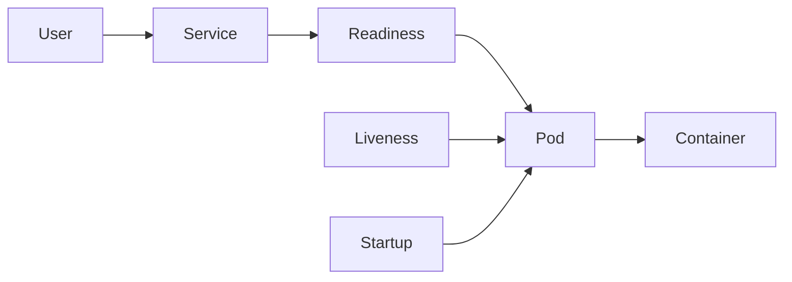
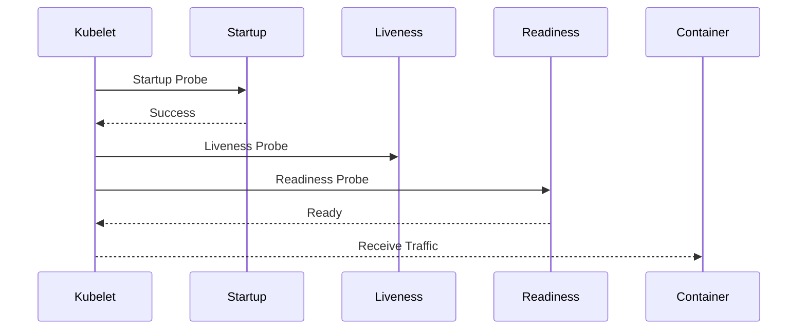

# Lab 04 - Health Probes

## Difficulty

⭐⭐⭐ Intermediate

## Estimated Time

35–45 minutes

---

# CKA Objectives Covered

* Configure Health Probes
* Troubleshoot unhealthy Pods
* Verify Pod readiness
* Understand container restart behavior

---

# Objective

In this lab, you will:

* Configure Startup Probes
* Configure Liveness Probes
* Configure Readiness Probes
* Observe Kubernetes health checks
* Troubleshoot failing probes

---

# Architecture



---

# Understanding the Three Probes

| Probe           | Purpose                                                | When Used                    |
| --------------- | ------------------------------------------------------ | ---------------------------- |
| Startup Probe   | Checks whether the application has finished starting   | Slow-starting applications   |
| Liveness Probe  | Detects whether the application is still alive         | Restart unhealthy containers |
| Readiness Probe | Determines whether the application can receive traffic | Control Service traffic      |

---

# Probe Execution Order



---

# Step 1 - Create the Pod

Create:

```text
probe-demo.yaml
```

```yaml
apiVersion: v1
kind: Pod
metadata:
  name: probe-demo

spec:

  containers:

  - name: nginx

    image: nginx

    ports:

    - containerPort: 80

    startupProbe:

      httpGet:

        path: /

        port: 80

      failureThreshold: 30

      periodSeconds: 5

    readinessProbe:

      httpGet:

        path: /

        port: 80

      initialDelaySeconds: 5

      periodSeconds: 5

    livenessProbe:

      httpGet:

        path: /

        port: 80

      initialDelaySeconds: 15

      periodSeconds: 10
```

---

# Step 2 - Deploy

```bash
kubectl apply -f probe-demo.yaml
```

---

# Step 3 - Verify

```bash
kubectl get pods
```

```bash
kubectl describe pod probe-demo
```

Observe:

* Startup Probe
* Readiness Probe
* Liveness Probe

---

# Step 4 - Observe Events

```bash
kubectl get events --sort-by=.lastTimestamp
```

Notice when probes begin executing.

---

# Step 5 - Break the Readiness Probe

Edit:

```yaml
path: /wrong-path
```

Apply again.

Observe:

```bash
kubectl get pods
```

The Pod stays Running.

But:

READY becomes

```text
0/1
```

Traffic will not be sent.

---

# Step 6 - Break the Liveness Probe

Modify:

```yaml
path: /wrong-path
```

Observe:

```bash
kubectl describe pod probe-demo
```

The container begins restarting.

---

# Step 7 - Observe Restart Count

```bash
kubectl get pods
```

Observe:

```text
RESTARTS
```

increasing.

---

# Step 8 - Restore Correct Configuration

Fix:

```yaml
path: /
```

Apply:

```bash
kubectl apply -f probe-demo.yaml
```

Everything should recover.

---

# Verification Checklist

✅ Startup Probe succeeded

✅ Readiness Probe passed

✅ Liveness Probe passed

✅ Pod received traffic

✅ Restart count observed

---

# Common Errors

## Readiness Failure

Symptoms:

READY

0/1

Pod Running

No traffic.

---

## Liveness Failure

Symptoms:

Restart count increases.

---

## Startup Failure

Application never becomes ready.

---

# Production Discussion

Use Startup Probe:

* Java
* Spring Boot
* Large applications

Use Readiness Probe:

* Database dependency
* Cache dependency

Use Liveness Probe:

* Deadlocks
* Hung processes
* Memory corruption

---

# Knowledge Check

1. Why do we need Startup Probes?
2. What happens if a Readiness Probe fails?
3. Does a failed Readiness Probe restart the container?
4. What happens if a Liveness Probe fails?
5. Which probe executes first?
6. Can all three probes exist simultaneously?
7. Why shouldn't Startup Probes be used on fast-starting applications?

---

# Cleanup

```bash
kubectl delete pod probe-demo
```

---

# Challenge

1. Create a Pod with all three probes.
2. Break the Readiness Probe.
3. Observe Service behavior.
4. Break the Liveness Probe.
5. Observe container restart.
6. Fix everything.
7. Verify recovery.
