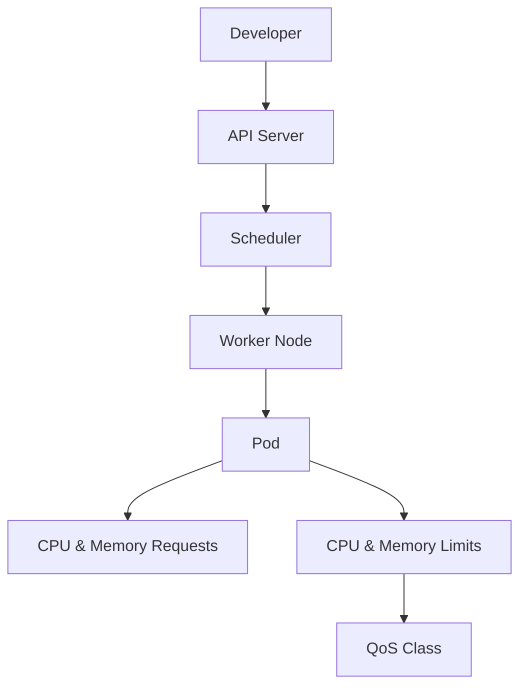

# Lab 05 - Resource Requests and Limits

## Difficulty

⭐⭐⭐ Intermediate

## Estimated Time

35–45 minutes

---

# CKA Objectives Covered

* Configure CPU requests
* Configure CPU limits
* Configure memory requests
* Configure memory limits
* Observe QoS classes
* Troubleshoot OOMKilled

---

# Objective

In this lab, you will:

* Configure CPU and memory requests.
* Configure CPU and memory limits.
* Observe Kubernetes scheduling decisions.
* Inspect the assigned QoS class.
* Understand how resource limits affect Pod behavior.

---

# Architecture



---

# Kubernetes Resources

## Requests

Requests represent the minimum resources guaranteed to a container.

The Scheduler uses requests when selecting a node.

---

## Limits

Limits define the maximum resources a container may consume.

If memory usage exceeds the limit, Kubernetes may terminate the container with **OOMKilled**.

---

# Step 1 - Create the YAML

Create:

```text
resource-demo.yaml
```

Paste:

```yaml
apiVersion: v1
kind: Pod
metadata:
  name: resource-demo

spec:

  containers:

  - name: nginx

    image: nginx

    resources:

      requests:
        cpu: "250m"
        memory: "128Mi"

      limits:
        cpu: "500m"
        memory: "256Mi"
```

---

# Step 2 - Deploy

```bash
kubectl apply -f resource-demo.yaml
```

Verify:

```bash
kubectl get pods
```

---

# Step 3 - Inspect the Pod

```bash
kubectl describe pod resource-demo
```

Locate:

* Requests
* Limits
* QoS Class

Observe that the Pod receives the **Burstable** QoS class.

---

# Step 4 - View the YAML

```bash
kubectl get pod resource-demo -o yaml
```

Inspect the `resources` section.

---

# Step 5 - View Resource Usage

If Metrics Server is installed:

```bash
kubectl top pod
```

or

```bash
kubectl top pod resource-demo
```

Observe CPU and memory usage.

---

# Step 6 - Understand QoS Classes

| QoS        | Condition                  |
| ---------- | -------------------------- |
| Guaranteed | Requests equal limits      |
| Burstable  | Requests lower than limits |
| BestEffort | No requests or limits      |

---

# Step 7 - Create a Guaranteed Pod

Modify the YAML:

```yaml
requests:
  cpu: "500m"
  memory: "256Mi"

limits:
  cpu: "500m"
  memory: "256Mi"
```

Recreate the Pod.

Describe it again.

Observe:

```
QoS Class: Guaranteed
```

---

# Step 8 - Create a BestEffort Pod

Remove the `resources:` section completely.

Deploy again.

Describe the Pod.

Observe:

```
QoS Class: BestEffort
```

---

# Verification Checklist

✅ Requests configured.

✅ Limits configured.

✅ QoS class identified.

✅ Resource usage viewed (if Metrics Server is available).

---

# Common Errors

## Pod Stuck in Pending

Possible causes:

* Insufficient CPU
* Insufficient memory
* Cluster resource exhaustion

Investigate:

```bash
kubectl describe pod resource-demo
kubectl describe node <node-name>
kubectl get events
```

---

## OOMKilled

Symptoms:

```text
Reason: OOMKilled
```

Investigation:

```bash
kubectl describe pod resource-demo
kubectl logs resource-demo --previous
kubectl top pod resource-demo
```

Resolution:

* Increase memory limit.
* Fix memory leaks.
* Optimize application memory usage.

---

# Production Discussion

Why configure requests?

* Better scheduling
* Prevents resource starvation
* Improves cluster stability

Why configure limits?

* Prevents runaway containers
* Protects other workloads
* Enables predictable resource usage

---

# Knowledge Check

1. What is the difference between a request and a limit?
2. Which component uses resource requests?
3. What happens if a Pod exceeds its memory limit?
4. What happens if a Pod exceeds its CPU limit?
5. Which QoS class has the highest priority?
6. Which QoS class is most likely to be evicted?
7. Why are requests important even when limits are configured?

---

# Cleanup

```bash
kubectl delete pod resource-demo
```

---

# Challenge

1. Create a Burstable Pod.
2. Create a Guaranteed Pod.
3. Create a BestEffort Pod.
4. Compare their QoS classes.
5. Compare the `kubectl describe pod` output.
6. Explain why Kubernetes assigned each QoS class.
