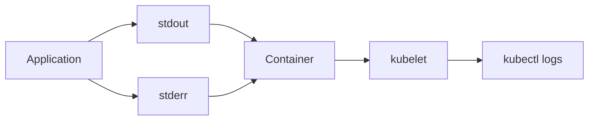

# Lab 06 - Viewing and Analyzing Pod Logs

## Difficulty

⭐⭐ Intermediate

## Estimated Time

20–30 minutes

---

# CKA Objectives Covered

* View Pod logs
* View logs from specific containers
* View previous logs
* Troubleshoot application failures

---

# Objective

In this lab, you will:

* View logs from a running Pod.
* View logs from a specific container in a multi-container Pod.
* Follow logs in real time.
* View previous logs after a container restart.
* Learn common logging commands used in production.

---

# Architecture



---

# Understanding Kubernetes Logs

Applications should write logs to:

* Standard Output (`stdout`)
* Standard Error (`stderr`)

Kubernetes captures these streams, making them available through:

```bash
kubectl logs
```

This is why containerized applications should avoid writing logs only to local files.

---

# Step 1 - Create a Pod

```bash
kubectl run nginx --image=nginx
```

Verify:

```bash
kubectl get pods
```

---

# Step 2 - View Logs

```bash
kubectl logs nginx
```

Observe the output.

Depending on activity, the NGINX container may show minimal or no logs until it receives requests.

---

# Step 3 - Generate Traffic

In another terminal:

```bash
kubectl port-forward pod/nginx 8080:80
```

Open:

```text
http://localhost:8080
```

Refresh the page a few times.

Return to the first terminal:

```bash
kubectl logs nginx
```

Observe new access log entries.

---

# Step 4 - Follow Logs

```bash
kubectl logs -f nginx
```

Refresh the browser again.

Watch log entries appear in real time.

Stop following logs with:

```text
Ctrl + C
```

---

# Step 5 - Logs from a Specific Container

If using the multi-container Pod from Lab 02:

```bash
kubectl logs multi-container-pod -c nginx

kubectl logs multi-container-pod -c busybox
```

Observe that each container has its own log stream.

---

# Step 6 - Previous Logs

Restart the Pod:

```bash
kubectl delete pod nginx
```

Or create a Pod that intentionally crashes.

View previous logs:

```bash
kubectl logs <pod-name> --previous
```

This command is especially useful when troubleshooting:

* CrashLoopBackOff
* OOMKilled
* Application crashes

---

# Step 7 - View Logs with Timestamps

```bash
kubectl logs nginx --timestamps
```

Useful for correlating logs with events and monitoring systems.

---

# Verification Checklist

✅ Viewed logs.

✅ Followed logs.

✅ Viewed container-specific logs.

✅ Viewed previous logs.

---

# Common Errors

## No Logs Displayed

Possible causes:

* Application has not generated output.
* Logs are written to files instead of stdout/stderr.

---

## Wrong Container

For multi-container Pods:

```bash
kubectl logs <pod-name> -c <container-name>
```

Always specify the container.

---

# Production Discussion

Best Practices:

* Log to stdout/stderr.
* Include timestamps.
* Use structured logs (JSON where appropriate).
* Aggregate logs with tools such as Fluent Bit, Fluentd, or Logstash.
* Centralize logs in platforms like Elasticsearch, Loki, or Splunk.

---

# Knowledge Check

1. Why should containers log to stdout/stderr?
2. What is the purpose of `kubectl logs -f`?
3. When would you use `--previous`?
4. Why do multi-container Pods require the `-c` option?
5. Why is centralized logging important in production?

---

# Cleanup

```bash
kubectl delete pod nginx
```

---

# Challenge

1. Create an NGINX Pod.
2. Generate traffic using `kubectl port-forward`.
3. Follow the logs in real time.
4. Create a multi-container Pod.
5. View logs from each container.
6. Explain the difference between current logs and previous logs.
