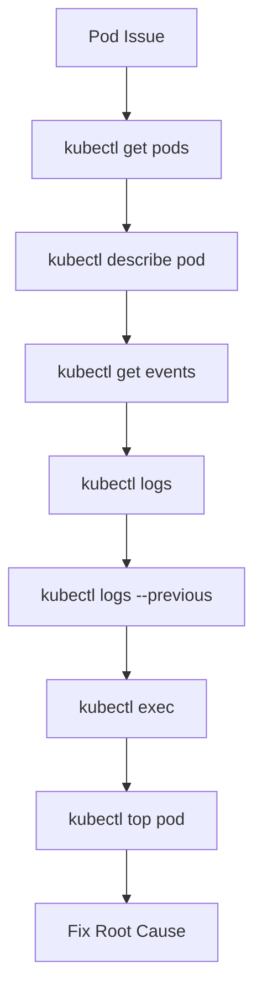

# Lab 08 - Pod Troubleshooting and Debugging

## Difficulty

⭐⭐⭐⭐ Advanced

## Estimated Time

45–60 minutes

---

# CKA Objectives Covered

* Troubleshoot Pods
* Interpret Pod status
* Analyze Events
* Investigate Logs
* Debug Running Containers
* Identify common Pod failures

---

# Objective

In this lab, you will:

* Follow a structured troubleshooting workflow.
* Diagnose common Pod failures.
* Use `kubectl get`, `describe`, `logs`, and `exec`.
* Understand common Pod error states.
* Practice real-world troubleshooting scenarios.

---

# Kubernetes Troubleshooting Workflow



---

# Scenario 1 - Pod Stuck in Pending

## Symptoms

```text
STATUS: Pending
```

### Investigation

```bash
kubectl get pods

kubectl describe pod <pod-name>

kubectl get events --sort-by=.lastTimestamp

kubectl get nodes
```

### Common Causes

* Insufficient CPU
* Insufficient Memory
* NodeSelector mismatch
* Taints
* PVC not bound

### Resolution

Fix the scheduling issue instead of deleting the Pod.

---

# Scenario 2 - ImagePullBackOff

## Symptoms

```text
STATUS: ImagePullBackOff
```

### Investigation

```bash
kubectl describe pod <pod-name>

kubectl get events
```

### Common Causes

* Wrong image
* Wrong tag
* Private registry authentication
* Registry unavailable

---

# Scenario 3 - CrashLoopBackOff

## Symptoms

```text
STATUS: CrashLoopBackOff
```

### Investigation

```bash
kubectl logs <pod>

kubectl logs <pod> --previous

kubectl describe pod <pod>
```

### Common Causes

* Application crash
* Missing configuration
* Startup command failure
* Dependency unavailable

---

# Scenario 4 - OOMKilled

## Symptoms

```text
Reason: OOMKilled
```

### Investigation

```bash
kubectl describe pod <pod>

kubectl top pod
```

### Resolution

* Increase memory limits.
* Reduce memory usage.
* Fix application memory leaks.

---

# Scenario 5 - Readiness Probe Failure

## Symptoms

```text
READY 0/1

STATUS Running
```

### Investigation

```bash
kubectl describe pod

kubectl logs
```

### Important

The Pod is running but **does not receive traffic** because it is not Ready.

---

# Scenario 6 - Liveness Probe Failure

## Symptoms

```text
RESTARTS increasing
```

### Investigation

```bash
kubectl describe pod

kubectl logs --previous
```

The container restarts because Kubernetes considers it unhealthy.

---

# Scenario 7 - Missing ConfigMap

## Symptoms

```text
CreateContainerConfigError
```

### Investigation

```bash
kubectl describe pod

kubectl get configmap
```

### Resolution

Create or correct the missing ConfigMap.

---

# Scenario 8 - Missing Secret

## Symptoms

```text
CreateContainerConfigError
```

### Investigation

```bash
kubectl describe pod

kubectl get secret
```

---

# Scenario 9 - DNS Resolution Failure

Enter the Pod:

```bash
kubectl exec -it <pod> -- sh
```

Verify:

```bash
nslookup kubernetes.default

ping kubernetes.default
```

---

# Scenario 10 - Verify Mounted Volumes

```bash
kubectl exec -it <pod> -- ls /data
```

Confirm:

* ConfigMap mounted
* Secret mounted
* Persistent Volume mounted

---

# Debugging Checklist

Always follow this order:

1. Check Pod status.

```bash
kubectl get pods
```

2. Describe the Pod.

```bash
kubectl describe pod <pod>
```

3. Review Events.

```bash
kubectl get events --sort-by=.lastTimestamp
```

4. Review Logs.

```bash
kubectl logs <pod>
```

5. Review Previous Logs.

```bash
kubectl logs <pod> --previous
```

6. Enter the Pod.

```bash
kubectl exec -it <pod> -- sh
```

7. Review Resource Usage.

```bash
kubectl top pod
```

---

# Production Discussion

When troubleshooting production issues:

* Never restart a Pod without understanding the cause.
* Capture logs before deleting a Pod.
* Preserve evidence.
* Investigate Events first.
* Document the root cause and resolution.

---

# Knowledge Check

1. What should you check first when a Pod is unhealthy?
2. Why is `kubectl describe` often more useful than logs initially?
3. What causes `Pending`?
4. What causes `ImagePullBackOff`?
5. Why use `--previous`?
6. What causes `CrashLoopBackOff`?
7. Why does `OOMKilled` occur?
8. What happens when a Readiness Probe fails?
9. What happens when a Liveness Probe fails?
10. Which command helps you inspect Events?

---

# Final Challenge

Without using your notes:

You discover the following:

```text
Pod: Running

READY: 0/1

RESTARTS: 6
```

Perform the following steps:

1. Determine why the Pod is unhealthy.
2. Inspect Events.
3. Review current logs.
4. Review previous logs.
5. Inspect the container.
6. Identify the root cause.
7. Explain your reasoning.
8. Propose a permanent fix.

---

# Cleanup

Delete any test Pods created during this lab:

```bash
kubectl delete pod --all
```

Verify:

```bash
kubectl get pods
```

No test Pods should remain.
