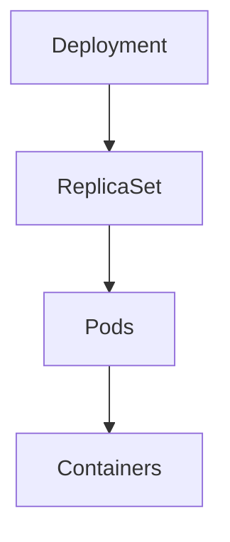

# Workloads - Cheat Sheet

> **Quick Revision Guide for Kubernetes Workloads**

---

# Kubernetes Workloads

| Workload | Purpose |
|----------|---------|
| Deployment | Manage stateless applications |
| ReplicaSet | Maintain desired number of Pods |
| DaemonSet | Run one Pod per node |
| StatefulSet | Manage stateful applications |
| Job | Run a task once |
| CronJob | Run tasks on a schedule |

---

# Workload Hierarchy



---

# Deployment

Used for:

- Web applications
- APIs
- Microservices
- Stateless workloads

Features:

- Self-healing
- Scaling
- Rolling updates
- Rollbacks

---

# ReplicaSet

Responsibilities:

- Maintain desired replica count
- Replace failed Pods

Normally managed by Deployments.

---

# DaemonSet

Runs one Pod on every eligible node.

Examples:

- Fluent Bit
- Prometheus Node Exporter
- CNI Plugins
- Security Agents

---

# StatefulSet

Features:

- Stable Pod names
- Stable storage
- Ordered deployment
- Ordered termination

Examples:

- MySQL
- PostgreSQL
- Kafka
- MongoDB

---

# Job

Runs until successful.

Examples:

- Database migration
- Batch processing
- Backup
- Data import

---

# CronJob

Runs Jobs on a schedule.

Examples:

- Nightly backup
- Report generation
- Log cleanup
- Certificate renewal

---

# Rolling Update

Default Deployment strategy.

Benefits:

- Zero downtime
- Gradual rollout
- Easy monitoring

Commands:

```bash
kubectl rollout status deployment/nginx

kubectl rollout history deployment/nginx
```

---

# Rollback

```bash
kubectl rollout undo deployment/nginx
```

Rollback to a specific revision:

```bash
kubectl rollout undo deployment/nginx \
--to-revision=2
```

---

# Scaling

```bash
kubectl scale deployment nginx \
--replicas=5
```

---

# Deployment Strategies

| Strategy | Downtime | Typical Use |
|----------|----------|-------------|
| RollingUpdate | No | Default |
| Recreate | Yes | Legacy apps |
| Blue/Green | No | Safe releases |
| Canary | No | Gradual testing |

---

# Common Commands

```bash
kubectl get deploy

kubectl get rs

kubectl get ds

kubectl get sts

kubectl get jobs

kubectl get cronjobs

kubectl describe deployment nginx

kubectl rollout status deployment/nginx

kubectl rollout history deployment/nginx

kubectl rollout undo deployment/nginx

kubectl rollout restart deployment/nginx

kubectl scale deployment nginx --replicas=5
```

---

# Workload Selection

| Requirement | Workload |
|-------------|----------|
| Stateless app | Deployment |
| One Pod per node | DaemonSet |
| Stable identity | StatefulSet |
| One-time task | Job |
| Scheduled task | CronJob |

---

# Production Best Practices

- Use Deployments for stateless applications.
- Avoid managing ReplicaSets directly.
- Use DaemonSets for node-level services.
- Use StatefulSets only when stable identities are required.
- Monitor rollouts before considering them complete.
- Always verify application health after deployments.

---

# CKA Memory Tricks

Deployment

↓

ReplicaSet

↓

Pods

↓

Containers

---

DaemonSet

↓

One Pod

↓

Every Node

---

Job

↓

Run Once

---

CronJob

↓

Run on Schedule

---

# Exam Tips

✔ Use:

```bash
kubectl rollout status deployment/<name>
```

to monitor updates.

✔ Use:

```bash
kubectl rollout undo deployment/<name>
```

for fast recovery.

✔ Verify ReplicaSets after Deployment updates.

✔ Remember that Deployments manage ReplicaSets automatically.

---

# Quick Review Checklist

☐ Deployment

☐ ReplicaSet

☐ DaemonSet

☐ StatefulSet

☐ Job

☐ CronJob

☐ Scaling

☐ Rolling Update

☐ Rollback

☐ Deployment Strategies
