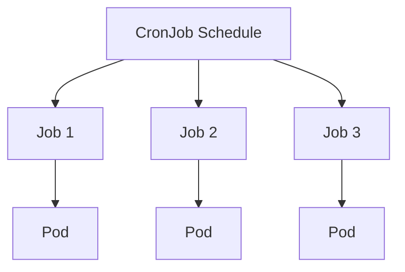

# CronJob

```mermaid
flowchart TD
    CronJob[CronJob Schedule]
    Job1[Job 1]
    Job2[Job 2]
    Job3[Job 3]
    Pod1[Pod]
    Pod2[Pod]
    Pod3[Pod]

    CronJob --> Job1
    CronJob --> Job2
    CronJob --> Job3

    Job1 --> Pod1
    Job2 --> Pod2
    Job3 --> Pod3
```

## Key Point

A CronJob creates Jobs according to a schedule.
