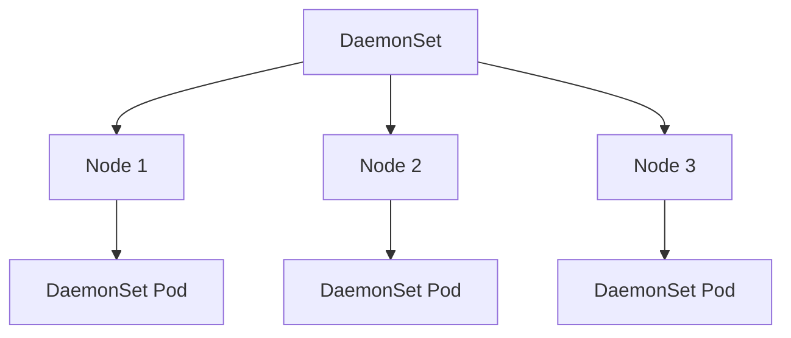

# DaemonSet

```mermaid
flowchart TD
    DaemonSet[DaemonSet]

    Node1[Node 1]
    Node2[Node 2]
    Node3[Node 3]

    Pod1[DaemonSet Pod]
    Pod2[DaemonSet Pod]
    Pod3[DaemonSet Pod]

    DaemonSet --> Node1
    DaemonSet --> Node2
    DaemonSet --> Node3

    Node1 --> Pod1
    Node2 --> Pod2
    Node3 --> Pod3
```

## Key Point

A DaemonSet runs one Pod on every eligible node.
