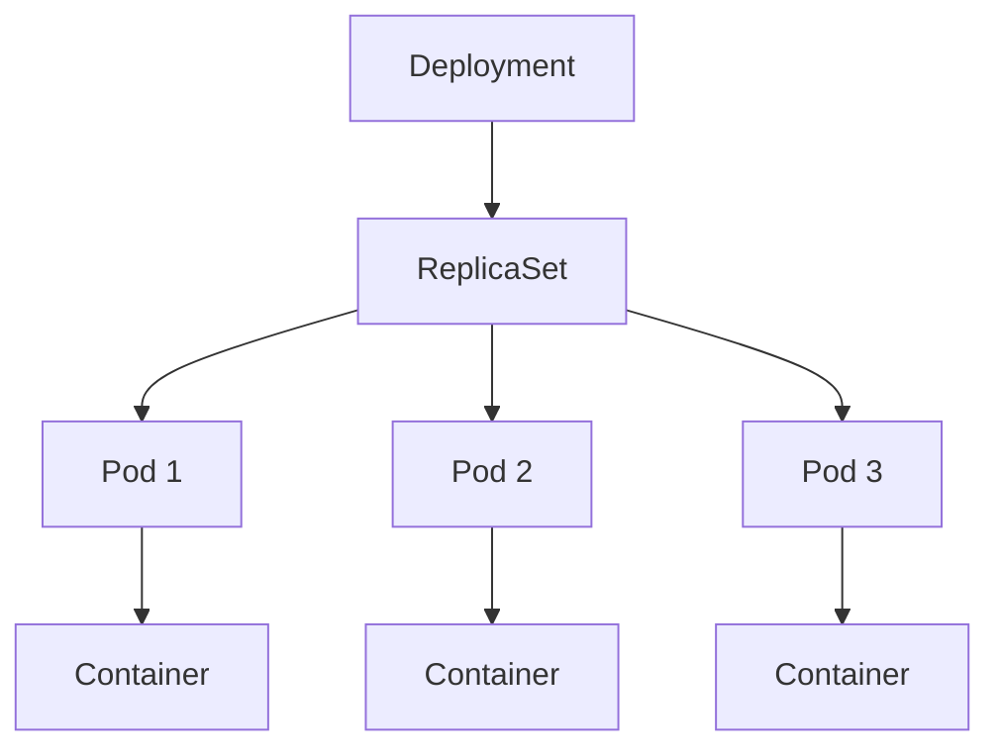

# Deployment Architecture

```mermaid
flowchart TD
    Deployment[Deployment]
    ReplicaSet[ReplicaSet]
    Pod1[Pod 1]
    Pod2[Pod 2]
    Pod3[Pod 3]
    C1[Container]
    C2[Container]
    C3[Container]

    Deployment --> ReplicaSet
    ReplicaSet --> Pod1
    ReplicaSet --> Pod2
    ReplicaSet --> Pod3
    Pod1 --> C1
    Pod2 --> C2
    Pod3 --> C3
```

## Key Point

A Deployment manages ReplicaSets. ReplicaSets manage Pods.
