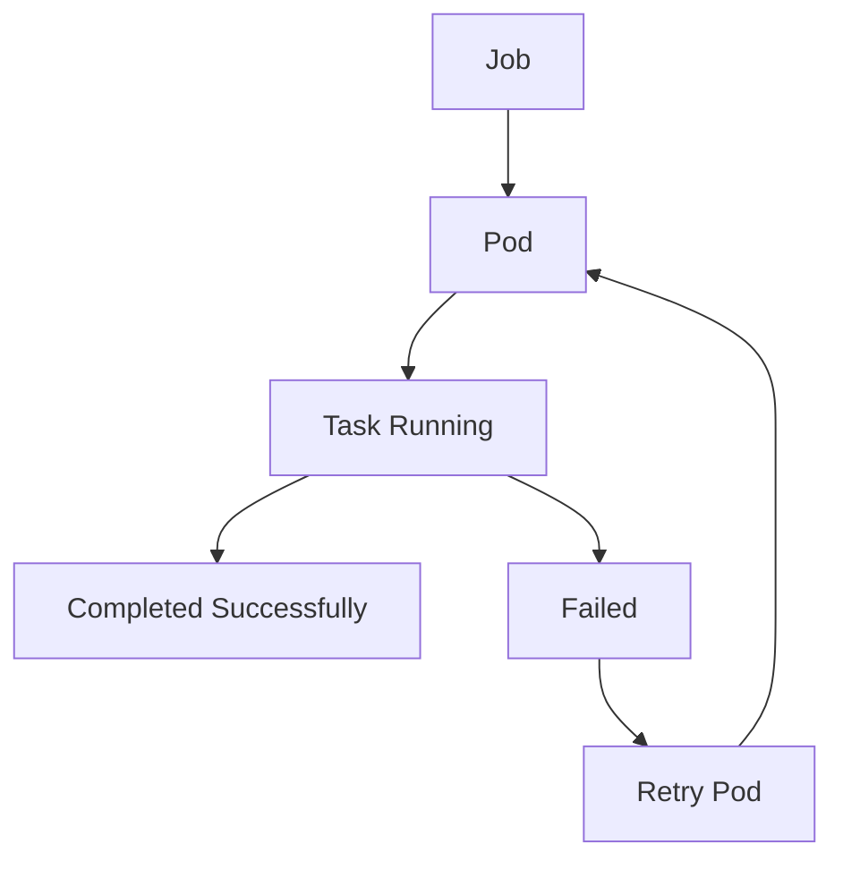

# Job Lifecycle

```mermaid
flowchart TD
    Job[Job]
    Pod[Pod]
    Task[Task Running]
    Success[Completed Successfully]
    Failed[Failed]
    Retry[Retry Pod]

    Job --> Pod
    Pod --> Task
    Task --> Success
    Task --> Failed
    Failed --> Retry
    Retry --> Pod
```

## Key Point

A Job runs Pods until the task completes successfully.
