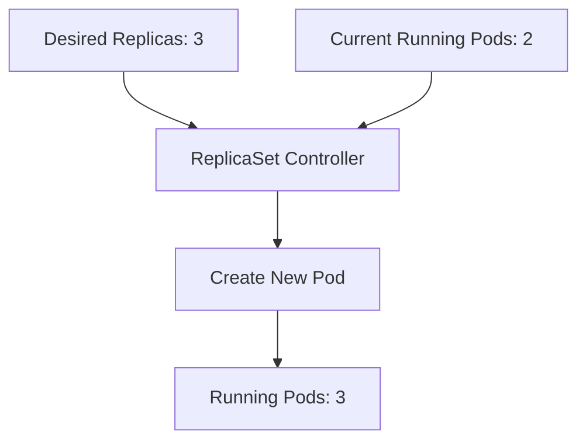

# ReplicaSet Reconciliation

```mermaid
flowchart TD
    Desired[Desired Replicas: 3]
    Current[Current Running Pods: 2]
    Controller[ReplicaSet Controller]
    NewPod[Create New Pod]
    Final[Running Pods: 3]

    Desired --> Controller
    Current --> Controller
    Controller --> NewPod
    NewPod --> Final
```

## Key Point

ReplicaSets continuously reconcile actual state with desired state.
