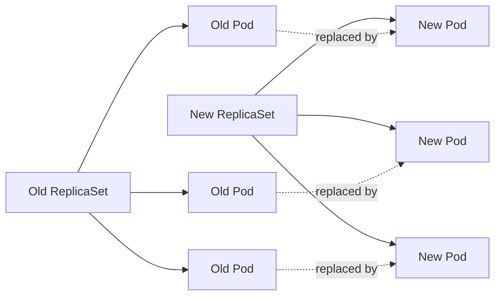

# Rolling Update

```mermaid
flowchart LR
    OldRS[Old ReplicaSet]
    OldPod1[Old Pod]
    OldPod2[Old Pod]
    OldPod3[Old Pod]

    NewRS[New ReplicaSet]
    NewPod1[New Pod]
    NewPod2[New Pod]
    NewPod3[New Pod]

    OldRS --> OldPod1
    OldRS --> OldPod2
    OldRS --> OldPod3

    NewRS --> NewPod1
    NewRS --> NewPod2
    NewRS --> NewPod3

    OldPod1 -. replaced by .-> NewPod1
    OldPod2 -. replaced by .-> NewPod2
    OldPod3 -. replaced by .-> NewPod3
```

## Key Point

Rolling updates gradually replace old Pods with new Pods.
