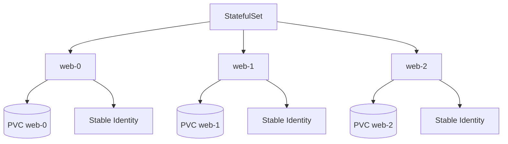

# StatefulSet

```mermaid
flowchart TD
    StatefulSet[StatefulSet]

    Pod0[web-0]
    Pod1[web-1]
    Pod2[web-2]

    PVC0[(PVC web-0)]
    PVC1[(PVC web-1)]
    PVC2[(PVC web-2)]

    StatefulSet --> Pod0
    StatefulSet --> Pod1
    StatefulSet --> Pod2

    Pod0 --> PVC0
    Pod1 --> PVC1
    Pod2 --> PVC2

    Pod0 --> Identity0[Stable Identity]
    Pod1 --> Identity1[Stable Identity]
    Pod2 --> Identity2[Stable Identity]
```

## Key Point

StatefulSets provide stable Pod names and stable storage.
