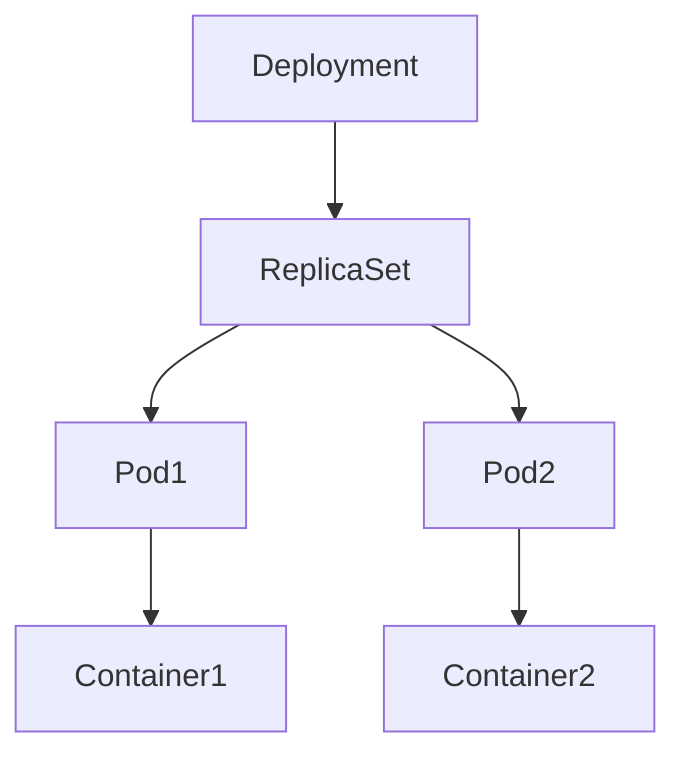

# Lab 01 - Deployments

## Difficulty

⭐ Beginner

## Estimated Time

20–30 minutes

---

# CKA Objectives Covered

- Create Deployments
- Inspect Deployments
- Understand Deployment hierarchy
- Verify Pods created by Deployments

---

# Objective

In this lab you will:

- Create a Deployment
- Inspect the Deployment
- Observe the ReplicaSet
- Observe the Pods
- Delete the Deployment

---

# Architecture



---

# Step 1 - Create Deployment

```bash
kubectl create deployment nginx --image=nginx
```

Verify:

```bash
kubectl get deploy
```

---

# Step 2 - View ReplicaSet

```bash
kubectl get rs
```

Notice that Kubernetes automatically created a ReplicaSet.

---

# Step 3 - View Pods

```bash
kubectl get pods
```

Notice the Pod name begins with the ReplicaSet name.

---

# Step 4 - Describe Deployment

```bash
kubectl describe deployment nginx
```

Observe:

- Replicas
- Strategy
- Labels
- Selector
- Events

---

# Step 5 - View Deployment YAML

```bash
kubectl get deployment nginx -o yaml
```

---

# Verification Checklist

✅ Deployment created

✅ ReplicaSet created

✅ Pod running

---

# Common Errors

Deployment not creating Pods.

Investigate:

```bash
kubectl describe deployment nginx

kubectl get rs

kubectl get pods
```

---

# Production Discussion

Deployments are the standard controller for stateless applications.

Examples:

- REST APIs
- Web applications
- Microservices

---

# Knowledge Check

1. Does a Deployment create Pods directly?
2. What creates Pods?
3. Why use Deployments instead of Pods?
4. What controller performs self-healing?

---

# Cleanup

```bash
kubectl delete deployment nginx
```

---

# Challenge

Create a Deployment named `redis` using the `redis:7` image and verify its ReplicaSet and Pod.
