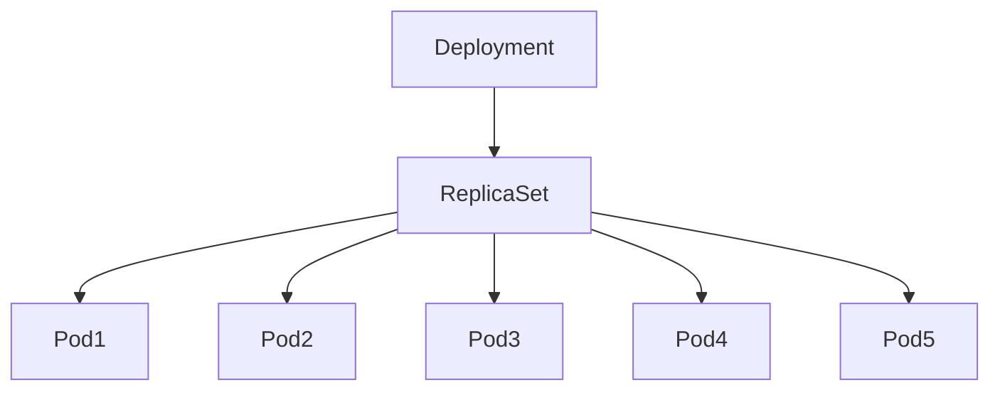

# Lab 02 - Scaling Deployments

## Difficulty

⭐ Beginner

## Estimated Time

20–30 minutes

---

# CKA Objectives Covered

* Scale Deployments
* Verify ReplicaSets
* Observe Pod creation and deletion
* Understand desired vs actual state

---

# Objective

In this lab, you will:

* Scale a Deployment up.
* Scale a Deployment down.
* Observe how ReplicaSets maintain the desired number of Pods.
* Verify Deployment status.

---

# Architecture



---

# Prerequisites

Create the Deployment if it does not already exist:

```bash
kubectl create deployment nginx --image=nginx
```

Verify:

```bash
kubectl get deploy
kubectl get rs
kubectl get pods
```

---

# Step 1 - Check Current Replicas

```bash
kubectl get deployment nginx
```

Expected:

```text
NAME    READY   UP-TO-DATE   AVAILABLE   AGE
nginx   1/1     1            1           1m
```

---

# Step 2 - Scale Up

Scale to 5 replicas:

```bash
kubectl scale deployment nginx --replicas=5
```

Verify:

```bash
kubectl get deployment nginx

kubectl get rs

kubectl get pods
```

Expected:

```text
READY

5/5
```

Observe:

* One ReplicaSet
* Five Pods
* Desired replicas = Current replicas

---

# Step 3 - Observe Self-Healing

Delete one Pod:

```bash
kubectl get pods

kubectl delete pod <pod-name>
```

Immediately watch:

```bash
kubectl get pods -w
```

Observe:

* Deleted Pod disappears.
* ReplicaSet automatically creates a new Pod.
* Desired replica count remains unchanged.

Stop watching:

```text
Ctrl + C
```

---

# Step 4 - Scale Down

Reduce replicas:

```bash
kubectl scale deployment nginx --replicas=2
```

Verify:

```bash
kubectl get deployment

kubectl get rs

kubectl get pods
```

Observe:

Only two Pods remain.

---

# Step 5 - Scale to Zero

```bash
kubectl scale deployment nginx --replicas=0
```

Verify:

```bash
kubectl get pods
```

Expected:

```text
No resources found
```

The Deployment still exists, but no Pods are running.

---

# Step 6 - Scale Back Up

```bash
kubectl scale deployment nginx --replicas=3
```

Verify:

```bash
kubectl get deploy

kubectl get rs

kubectl get pods
```

Observe that Kubernetes recreates the Pods.

---

# Verification Checklist

✅ Deployment scaled successfully.

✅ ReplicaSet maintained desired state.

✅ Pods recreated after deletion.

✅ Scaling to zero removed all Pods.

✅ Scaling back up recreated the application.

---

# Common Errors

## Pods Not Scaling

Investigate:

```bash
kubectl describe deployment nginx

kubectl describe rs

kubectl get events
```

Possible causes:

* Resource constraints
* Node capacity
* Scheduling failures

---

# Production Discussion

Scaling is commonly used for:

* Handling traffic spikes.
* Reducing costs during low demand.
* Maintenance windows.
* Disaster recovery.

Manual scaling is useful, but most production environments also use the Horizontal Pod Autoscaler (HPA).

---

# Knowledge Check

1. Which controller performs the scaling?
2. What happens when you delete a Pod managed by a Deployment?
3. Does scaling change the ReplicaSet or create a new one?
4. What happens when you scale to zero?
5. Does the Deployment still exist after scaling to zero?

---

# Cleanup

Leave the Deployment running with:

```bash
kubectl scale deployment nginx --replicas=3
```

The next lab will use this Deployment.

---

# Challenge

1. Scale the Deployment to 10 replicas.
2. Delete three Pods.
3. Observe Kubernetes recreate them.
4. Scale down to one replica.
5. Explain which controller was responsible for each action.
