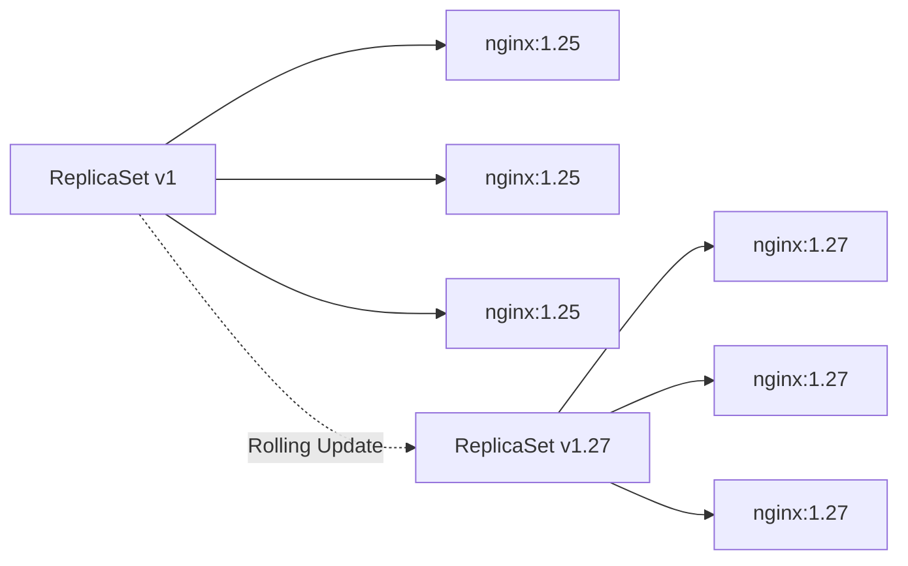

# Lab 03 - Rolling Updates

## Difficulty

⭐⭐ Intermediate

## Estimated Time

30–40 minutes

---

# CKA Objectives Covered

* Perform rolling updates
* Monitor rollout progress
* Verify ReplicaSets
* Observe Pod replacement
* Understand zero-downtime deployments

---

# Objective

In this lab, you will:

* Update a Deployment image.
* Monitor the rollout.
* Observe the creation of a new ReplicaSet.
* Verify old Pods are replaced gradually.
* Understand how Kubernetes performs zero-downtime updates.

---

# Architecture



---

# Prerequisites

Verify the Deployment exists:

```bash
kubectl get deployment nginx

kubectl get rs

kubectl get pods
```

---

# Step 1 - Check Current Image

```bash
kubectl describe deployment nginx
```

Locate:

```text
Image:
```

---

# Step 2 - Update the Image

Update the Deployment:

```bash
kubectl set image deployment/nginx \
nginx=nginx:1.27
```

---

# Step 3 - Watch the Rollout

```bash
kubectl rollout status deployment/nginx
```

Expected:

```text
deployment "nginx" successfully rolled out
```

---

# Step 4 - Observe ReplicaSets

```bash
kubectl get rs
```

Notice:

* Old ReplicaSet still exists.
* New ReplicaSet has been created.

Example:

```text
NAME                  DESIRED

nginx-54c8f8d       0

nginx-67c77b7       3
```

---

# Step 5 - Observe Pods

```bash
kubectl get pods -w
```

Watch:

* New Pods created.
* Old Pods terminated gradually.

Stop:

```text
Ctrl + C
```

---

# Step 6 - Verify New Image

```bash
kubectl describe pod <new-pod-name>
```

Verify:

```text
Image:

nginx:1.27
```

---

# Step 7 - View Rollout History

```bash
kubectl rollout history deployment/nginx
```

Observe:

Deployment revisions.

---

# Step 8 - Compare ReplicaSets

```bash
kubectl describe rs
```

Observe:

Old ReplicaSet:

```text
Desired:

0
```

New ReplicaSet:

```text
Desired:

3
```

---

# Verification Checklist

✅ New ReplicaSet created.

✅ Old ReplicaSet retained.

✅ New Pods running.

✅ Old Pods terminated.

✅ Deployment successfully rolled out.

---

# Common Errors

## Rollout Stuck

Investigate:

```bash
kubectl rollout status deployment/nginx

kubectl describe deployment nginx

kubectl get events
```

Possible causes:

* Readiness Probe failure.
* Image pull issue.
* Resource shortage.

---

# Production Discussion

Rolling Updates provide:

* Zero downtime
* Controlled rollout
* Easy rollback
* Safer deployments

This is the default Deployment strategy in Kubernetes.

---

# Knowledge Check

1. Does a Rolling Update replace all Pods at once?
2. What new Kubernetes object is created during a Rolling Update?
3. Why is the old ReplicaSet retained?
4. How can you monitor rollout progress?
5. Which command shows rollout history?

---

# Cleanup

Keep the updated Deployment.

The next lab will roll back to the previous version.

---

# Challenge

1. Update the image to another version (for example, `nginx:1.28` if available, or another valid version).
2. Monitor the rollout.
3. Observe the new ReplicaSet.
4. Verify the image running in the Pods.
5. Explain why the old ReplicaSet still exists.
