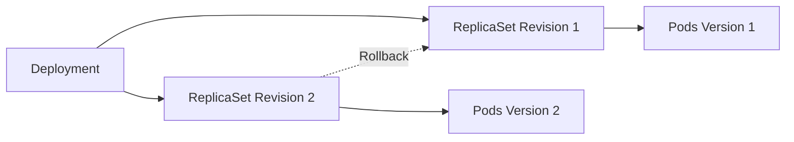

# Lab 04 - Rollbacks

## Difficulty

⭐⭐ Intermediate

## Estimated Time

25–35 minutes

---

# CKA Objectives Covered

* View rollout history
* Roll back Deployments
* Verify Deployment revisions
* Understand ReplicaSet history

---

# Objective

In this lab, you will:

* View Deployment revision history.
* Roll back to the previous Deployment version.
* Verify that Pods are recreated using the previous ReplicaSet.
* Understand how Kubernetes stores Deployment revisions.

---

# Architecture



---

# Prerequisites

Verify your Deployment:

```bash
kubectl get deployment nginx

kubectl get rs

kubectl get pods
```

---

# Step 1 - View Rollout History

```bash
kubectl rollout history deployment/nginx
```

Expected output:

```text
REVISION   CHANGE-CAUSE
1          Initial deployment
2          Updated image
```

---

# Step 2 - View ReplicaSets

```bash
kubectl get rs
```

Observe:

* Current ReplicaSet
* Previous ReplicaSet

---

# Step 3 - Roll Back

```bash
kubectl rollout undo deployment/nginx
```

Expected:

```text
deployment.apps/nginx rolled back
```

---

# Step 4 - Monitor Rollback

```bash
kubectl rollout status deployment/nginx
```

Expected:

```text
deployment "nginx" successfully rolled out
```

---

# Step 5 - Verify ReplicaSets

```bash
kubectl get rs
```

Observe:

* Previous ReplicaSet becomes active again.
* Newer ReplicaSet scales down.

---

# Step 6 - Verify Pods

```bash
kubectl get pods -w
```

Watch:

* Current Pods terminate.
* Replacement Pods are created from the previous ReplicaSet.

Stop watching:

```text
Ctrl + C
```

---

# Step 7 - Verify Image

```bash
kubectl describe pod <pod-name>
```

Confirm that the image matches the previous Deployment revision.

---

# Step 8 - Roll Back to a Specific Revision

Display revision history:

```bash
kubectl rollout history deployment/nginx
```

Roll back to a specific revision:

```bash
kubectl rollout undo deployment/nginx --to-revision=1
```

Verify:

```bash
kubectl rollout status deployment/nginx
```

---

# Verification Checklist

✅ Rollout history displayed.

✅ Deployment rolled back successfully.

✅ Previous ReplicaSet active.

✅ Pods recreated.

✅ Previous application version restored.

---

# Common Errors

## No Previous Revision Available

Possible cause:

Only one Deployment revision exists.

Verify:

```bash
kubectl rollout history deployment/nginx
```

---

## Rollback Does Not Restore the Application

Investigate:

```bash
kubectl describe deployment nginx

kubectl get rs

kubectl get pods

kubectl get events
```

Possible causes:

* Image removed from registry.
* Configuration changes outside the Deployment.
* Environment differences.

---

# Production Discussion

Rollbacks are commonly used when:

* A new release introduces errors.
* Readiness probes fail.
* Performance degrades.
* Critical bugs are discovered.
* Users report application issues after deployment.

Rollbacks should be quick, but always perform a root cause analysis after restoring service.

---

# Knowledge Check

1. What command displays Deployment revision history?
2. What object stores Deployment revisions?
3. Does Kubernetes delete old ReplicaSets immediately?
4. Can you roll back to a specific revision?
5. Why are previous ReplicaSets retained?

---

# Cleanup

Leave the Deployment running.

The next lab will continue using the existing Deployment.

---

# Challenge

1. Update the Deployment to a newer image.
2. Verify the rollout.
3. Roll back to the previous revision.
4. Verify the image running in the Pods.
5. Explain what happened to the ReplicaSets during the rollback.
