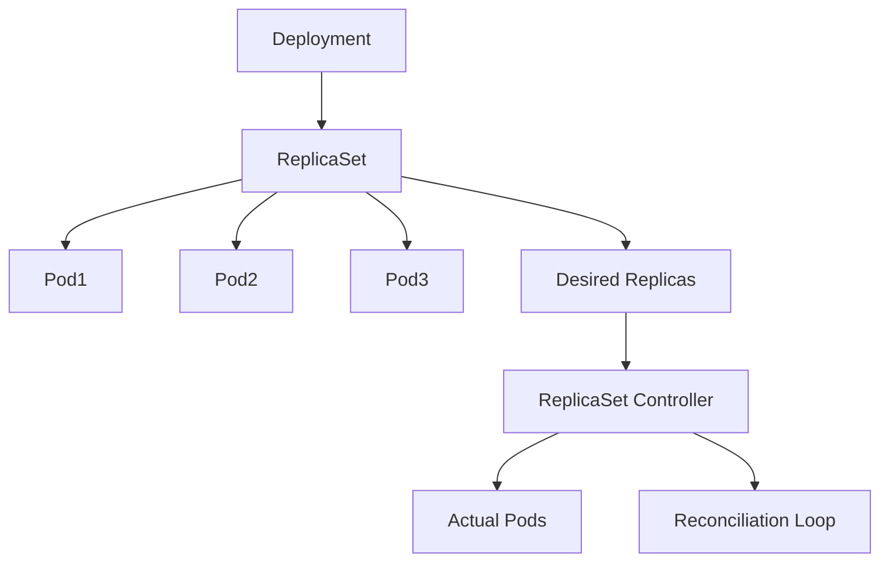

# Lab 05 - ReplicaSets

## Difficulty

⭐⭐ Intermediate

## Estimated Time

25–35 minutes

---

# CKA Objectives Covered

* Understand ReplicaSets
* Inspect ReplicaSets
* Verify Deployment ownership
* Observe self-healing
* Understand Kubernetes reconciliation

---

# Objective

In this lab, you will:

* Inspect ReplicaSets created by a Deployment.
* Understand the relationship between Deployments and ReplicaSets.
* Observe ReplicaSet self-healing.
* Verify owner references.
* Understand the reconciliation loop.

---

# Architecture



---

# Prerequisites

Verify the Deployment exists:

```bash
kubectl get deploy

kubectl get rs

kubectl get pods
```

---

# Step 1 - List ReplicaSets

```bash
kubectl get rs
```

Example:

```text
NAME                DESIRED   CURRENT   READY

nginx-74f5b89d8f    3         3         3
```

Observe:

* Desired replicas
* Current replicas
* Ready replicas

---

# Step 2 - Describe the ReplicaSet

```bash
kubectl describe rs
```

Locate:

* Labels
* Selector
* Pod Template
* Events
* Owner References

Observe that the ReplicaSet is owned by the Deployment.

---

# Step 3 - View ReplicaSet YAML

```bash
kubectl get rs -o yaml
```

Locate:

```yaml
ownerReferences:
```

Notice the Deployment is the owner.

---

# Step 4 - Delete a Pod

List Pods:

```bash
kubectl get pods
```

Delete one Pod:

```bash
kubectl delete pod <pod-name>
```

Immediately watch:

```bash
kubectl get pods -w
```

Observe:

* Pod deleted.
* ReplicaSet detects fewer Pods.
* ReplicaSet creates a replacement Pod.
* Desired state restored automatically.

Stop watching:

```text
Ctrl + C
```

---

# Step 5 - Observe Reconciliation

Run:

```bash
kubectl get rs

kubectl get pods
```

Compare:

* Desired replicas
* Current replicas
* Ready replicas

Notice Kubernetes continuously reconciles the actual state with the desired state.

---

# Step 6 - Scale the Deployment

Scale to five replicas:

```bash
kubectl scale deployment nginx --replicas=5
```

Verify:

```bash
kubectl get rs

kubectl get pods
```

Observe:

The ReplicaSet now maintains five Pods.

---

# Step 7 - Scale Down

```bash
kubectl scale deployment nginx --replicas=2
```

Verify:

```bash
kubectl get rs

kubectl get pods
```

Observe that excess Pods are terminated until only two remain.

---

# Verification Checklist

✅ ReplicaSet identified.

✅ Owner reference verified.

✅ Self-healing observed.

✅ Reconciliation understood.

✅ Scaling reflected in ReplicaSet.

---

# Common Errors

## ReplicaSet Not Creating Pods

Investigate:

```bash
kubectl describe rs

kubectl get events

kubectl describe pod <pod-name>
```

Possible causes:

* Resource shortages
* Node scheduling issues
* Invalid Pod template

---

## Multiple ReplicaSets Exist

This is expected after rolling updates.

Check:

```bash
kubectl rollout history deployment/nginx

kubectl get rs
```

Older ReplicaSets are retained for rollback purposes.

---

# Production Discussion

Although Deployments manage ReplicaSets automatically, understanding ReplicaSets helps explain:

* Self-healing
* Rolling updates
* Rollbacks
* Desired state reconciliation

In production, engineers rarely create ReplicaSets directly.

Instead, they work with Deployments.

---

# Knowledge Check

1. What is the primary responsibility of a ReplicaSet?
2. Does a Deployment create Pods directly?
3. What happens when a Pod managed by a ReplicaSet is deleted?
4. Why do old ReplicaSets remain after a rolling update?
5. What is the reconciliation loop?

---

# Cleanup

Leave the Deployment running with two replicas.

The next lab will use it.

---

# Challenge

1. Scale the Deployment to four replicas.
2. Delete two Pods.
3. Observe Kubernetes recreate them.
4. Inspect the ReplicaSet owner reference.
5. Explain how the reconciliation loop restored the desired state.
