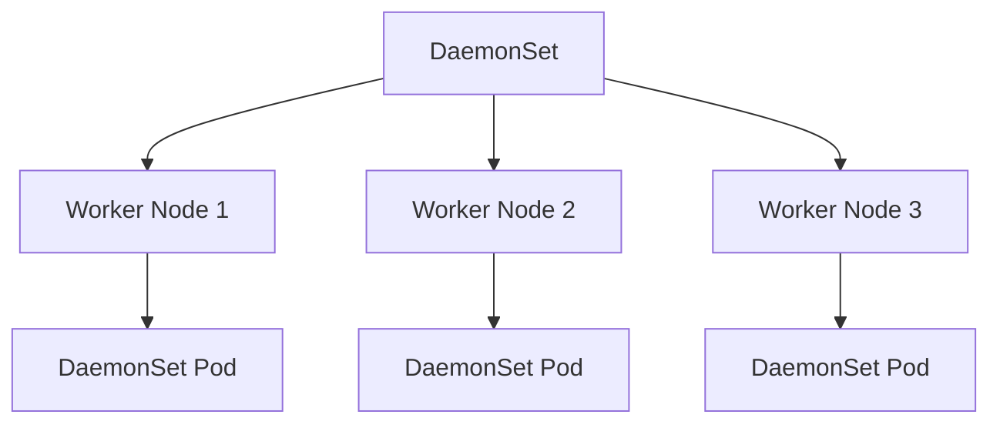

# Lab 06 - DaemonSets

## Difficulty

⭐⭐⭐ Intermediate

## Estimated Time

30–40 minutes

---

# CKA Objectives Covered

* Create DaemonSets
* Understand node-level workloads
* Verify one Pod per node
* Inspect DaemonSet scheduling
* Understand infrastructure workloads

---

# Objective

In this lab, you will:

* Create a DaemonSet.
* Verify one Pod runs on every eligible node.
* Observe DaemonSet behavior when nodes are added.
* Understand common production use cases.

---

# Architecture



---

# What is a DaemonSet?

A DaemonSet ensures that **one Pod runs on every eligible node**.

Unlike Deployments, you do **not** specify the number of replicas.

The number of Pods automatically matches the number of eligible nodes.

---

# Production Use Cases

DaemonSets are commonly used for:

* Fluent Bit
* Fluentd
* Prometheus Node Exporter
* Calico
* Cilium
* Datadog Agent
* Falco
* Security monitoring agents

---

# Step 1 - Create the YAML

Create:

```text
daemonset.yaml
```

Paste:

```yaml
apiVersion: apps/v1
kind: DaemonSet
metadata:
  name: nginx-daemon

spec:
  selector:
    matchLabels:
      app: nginx-daemon

  template:
    metadata:
      labels:
        app: nginx-daemon

    spec:
      containers:
      - name: nginx
        image: nginx
```

---

# Step 2 - Deploy

```bash
kubectl apply -f daemonset.yaml
```

Verify:

```bash
kubectl get ds
```

Example:

```text
NAME            DESIRED CURRENT READY

nginx-daemon       3       3      3
```

*(Your numbers depend on how many nodes are in your cluster.)*

---

# Step 3 - View Pods

```bash
kubectl get pods -o wide
```

Observe:

Each node has one DaemonSet Pod.

---

# Step 4 - Describe the DaemonSet

```bash
kubectl describe ds nginx-daemon
```

Observe:

* Desired Number of Nodes Scheduled
* Current Number Scheduled
* Number Ready
* Events

---

# Step 5 - Verify Scheduling

List nodes:

```bash
kubectl get nodes
```

Compare:

```bash
kubectl get pods -o wide
```

Verify:

One Pod exists on every eligible node.

---

# Step 6 - Simulate a Node Addition (Concept)

If a new node joins the cluster:

* Kubernetes automatically schedules one DaemonSet Pod on the new node.
* No manual scaling is required.

---

# Step 7 - Delete a DaemonSet Pod

```bash
kubectl get pods

kubectl delete pod <daemonset-pod>
```

Watch:

```bash
kubectl get pods -w
```

Observe:

The DaemonSet recreates the Pod automatically.

---

# Verification Checklist

✅ DaemonSet created.

✅ One Pod per node.

✅ Self-healing observed.

✅ Scheduling verified.

---

# Common Errors

## Missing DaemonSet Pod

Investigate:

```bash
kubectl describe ds nginx-daemon

kubectl describe node <node-name>

kubectl get events
```

Possible causes:

* Node selector
* Taints
* Node NotReady
* Insufficient resources

---

## More Than One Pod on a Node

Normally, a DaemonSet schedules one Pod per eligible node.

Multiple Pods may indicate another controller or a configuration issue.

---

# Production Discussion

Use DaemonSets for:

* Logging
* Monitoring
* Security agents
* Networking components

Do **not** use DaemonSets for:

* Web applications
* APIs
* Microservices
* Databases

Those are better suited to Deployments or StatefulSets.

---

# Knowledge Check

1. What is a DaemonSet?
2. How many Pods does it create per node?
3. Do DaemonSets use replicas?
4. What happens when a new node joins the cluster?
5. Name three production tools that commonly run as DaemonSets.

---

# Cleanup

```bash
kubectl delete ds nginx-daemon
```

Verify:

```bash
kubectl get ds

kubectl get pods
```

---

# Challenge

1. Create a DaemonSet.
2. Verify one Pod per node.
3. Delete one DaemonSet Pod.
4. Observe Kubernetes recreate it.
5. Explain why a Deployment is not suitable for this workload.
