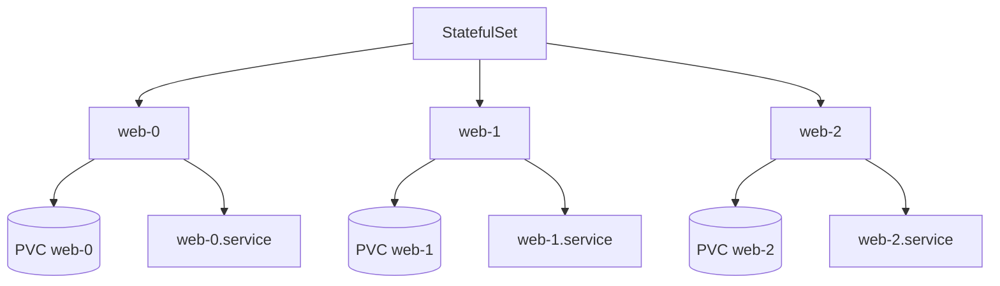

# Lab 07 - StatefulSets

## Difficulty

⭐⭐⭐ Advanced

## Estimated Time

40–50 minutes

---

# CKA Objectives Covered

* Create StatefulSets
* Understand stable Pod identities
* Understand stable storage
* Verify ordered startup
* Verify ordered termination

---

# Objective

In this lab, you will:

* Create a StatefulSet.
* Observe predictable Pod names.
* Understand stable identities.
* Verify ordered Pod creation.
* Learn why StatefulSets are used for databases.

---

# Architecture



---

# Why StatefulSets?

Deployments provide:

* Random Pod names
* Interchangeable Pods

StatefulSets provide:

* Stable Pod names
* Stable DNS names
* Stable storage
* Ordered deployment
* Ordered termination

---

# Production Examples

StatefulSets are commonly used for:

* PostgreSQL
* MySQL
* MongoDB
* Kafka
* ZooKeeper
* Elasticsearch
* Redis Cluster

---

# Step 1 - Create a Headless Service

Create:

```text
headless-service.yaml
```

```yaml
apiVersion: v1
kind: Service
metadata:
  name: nginx

spec:
  clusterIP: None

  selector:
    app: nginx

  ports:
  - port: 80
```

Apply:

```bash
kubectl apply -f headless-service.yaml
```

---

# Step 2 - Create the StatefulSet

Create:

```text
statefulset.yaml
```

```yaml
apiVersion: apps/v1
kind: StatefulSet

metadata:
  name: web

spec:

  serviceName: nginx

  replicas: 3

  selector:
    matchLabels:
      app: nginx

  template:

    metadata:
      labels:
        app: nginx

    spec:

      containers:

      - name: nginx

        image: nginx

        ports:

        - containerPort: 80
```

Apply:

```bash
kubectl apply -f statefulset.yaml
```

---

# Step 3 - Observe Pod Names

```bash
kubectl get pods
```

Expected:

```text
web-0

web-1

web-2
```

Notice:

The names are predictable and stable.

---

# Step 4 - Observe Ordered Startup

Watch:

```bash
kubectl get pods -w
```

Observe:

```
web-0

↓

web-1

↓

web-2
```

Each Pod starts only after the previous Pod becomes Ready.

---

# Step 5 - Describe the StatefulSet

```bash
kubectl describe sts web
```

Observe:

* Replicas
* Service Name
* Pod Template
* Events

---

# Step 6 - Scale the StatefulSet

```bash
kubectl scale sts web --replicas=5
```

Verify:

```bash
kubectl get pods
```

Observe:

```
web-3

web-4
```

---

# Step 7 - Scale Down

```bash
kubectl scale sts web --replicas=2
```

Observe:

Pods terminate in reverse order:

```
web-4

↓

web-3

↓

web-2
```

---

# Step 8 - Delete a Pod

Delete:

```bash
kubectl delete pod web-0
```

Observe:

The replacement Pod is also named:

```
web-0
```

The identity is preserved.

---

# Verification Checklist

✅ Stable Pod names.

✅ Ordered startup.

✅ Ordered termination.

✅ Stable identities.

---

# Common Errors

## Pods Stuck in Pending

Investigate:

```bash
kubectl describe pod web-0

kubectl get pvc

kubectl get pv
```

Possible causes:

* Missing StorageClass
* Unbound PVC
* Insufficient storage

---

## Headless Service Missing

Without a headless Service:

Stable DNS names will not work.

---

# Production Discussion

Use StatefulSets when applications require:

* Stable network identity
* Stable storage
* Ordered startup
* Ordered shutdown

Do not use StatefulSets for stateless web applications.

---

# Knowledge Check

1. Why are Deployments unsuitable for databases?
2. Why do StatefulSets require a headless Service?
3. What happens if web-0 is deleted?
4. Do StatefulSets create Pods in parallel?
5. Why is ordered startup important?

---

# Cleanup

```bash
kubectl delete sts web

kubectl delete service nginx
```

PVCs may remain depending on your cluster configuration.

---

# Challenge

1. Create a StatefulSet with three replicas.
2. Verify Pod names.
3. Scale to five replicas.
4. Delete web-1.
5. Verify that Kubernetes recreates **web-1** instead of a randomly named Pod.
6. Explain why this behavior is critical for databases.
