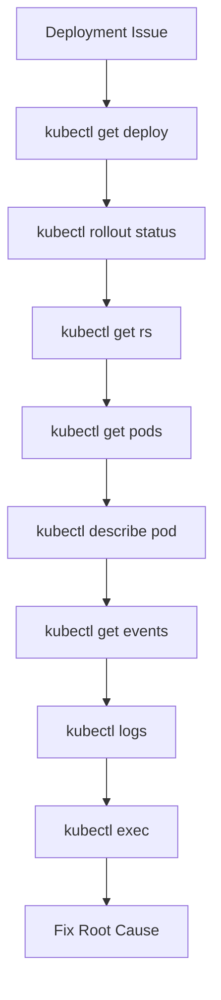

# Lab 10 - Deployment Debugging

## Difficulty

⭐⭐⭐⭐ Advanced

## Estimated Time

60–75 minutes

---

# CKA Objectives Covered

* Troubleshoot Deployments
* Analyze ReplicaSets
* Investigate Pods
* Review Events
* Analyze Logs
* Recover failed Deployments

---

# Objective

In this lab, you will:

* Troubleshoot common Deployment failures.
* Follow a structured debugging workflow.
* Diagnose rollout failures.
* Identify root causes.
* Recover the application safely.

---

# Production Troubleshooting Workflow

Always investigate in this order:



Never begin by deleting Pods.

---

# Scenario 1 - ImagePullBackOff

## Symptoms

```text
STATUS

ImagePullBackOff
```

### Investigation

```bash
kubectl describe pod <pod>

kubectl get events
```

### Possible Causes

* Wrong image name
* Invalid image tag
* Private registry authentication failure
* Registry unavailable

### Resolution

Correct the image name or tag and redeploy.

---

# Scenario 2 - CrashLoopBackOff

## Symptoms

```text
STATUS

CrashLoopBackOff
```

### Investigation

```bash
kubectl logs <pod>

kubectl logs <pod> --previous

kubectl describe pod <pod>
```

### Possible Causes

* Application crash
* Configuration error
* Missing dependency
* Startup script failure

---

# Scenario 3 - Pods Stuck in Pending

## Symptoms

```text
STATUS

Pending
```

### Investigation

```bash
kubectl describe pod <pod>

kubectl get nodes

kubectl get events
```

### Possible Causes

* CPU exhaustion
* Memory exhaustion
* Node selector mismatch
* Taints and tolerations
* PVC not bound

---

# Scenario 4 - Readiness Probe Failure

## Symptoms

```text
READY

0/1
```

Deployment rollout never completes.

### Investigation

```bash
kubectl describe pod <pod>

kubectl logs <pod>
```

### Possible Causes

* Wrong endpoint
* Slow application startup
* Port mismatch
* Dependency unavailable

---

# Scenario 5 - Rollout Timeout

## Symptoms

```bash
kubectl rollout status deployment/nginx
```

Returns:

```text
Waiting for deployment rollout to finish...
```

### Investigation

```bash
kubectl describe deployment nginx

kubectl get rs

kubectl get pods
```

---

# Scenario 6 - Replica Mismatch

## Symptoms

```text
Desired: 5

Ready: 2
```

### Investigation

```bash
kubectl describe deployment

kubectl describe rs

kubectl get pods
```

### Possible Causes

* Scheduling failures
* Pod crashes
* Resource shortages

---

# Scenario 7 - Failed Rollback

## Investigation

```bash
kubectl rollout history deployment/nginx

kubectl rollout undo deployment/nginx

kubectl describe deployment nginx
```

### Possible Causes

* Missing revision
* Removed image
* Configuration drift

---

# Scenario 8 - DaemonSet Missing on a Node

## Investigation

```bash
kubectl describe ds

kubectl describe node

kubectl get events
```

### Possible Causes

* Taints
* Node selector
* Node NotReady

---

# Scenario 9 - StatefulSet Pending

## Investigation

```bash
kubectl describe sts

kubectl describe pod

kubectl get pvc

kubectl get pv
```

### Possible Causes

* Missing StorageClass
* PVC not bound
* Storage unavailable

---

# Scenario 10 - CronJob Never Executes

## Investigation

```bash
kubectl describe cronjob

kubectl get jobs

kubectl get events
```

### Possible Causes

* Invalid schedule
* Suspended CronJob
* Controller issue

---

# Production Debugging Checklist

Always ask:

### Is the Deployment healthy?

```bash
kubectl get deploy
```

---

### Is the rollout complete?

```bash
kubectl rollout status deployment/<name>
```

---

### Is the ReplicaSet healthy?

```bash
kubectl get rs
```

---

### Are Pods healthy?

```bash
kubectl get pods
```

---

### What do Events say?

```bash
kubectl get events --sort-by=.lastTimestamp
```

---

### What do the logs show?

```bash
kubectl logs <pod>

kubectl logs <pod> --previous
```

---

### Can I inspect the container?

```bash
kubectl exec -it <pod> -- sh
```

---

# Production Tips

* Never delete Pods before understanding the issue.
* Save logs before restarting containers.
* Verify rollout status after every deployment.
* Use versioned image tags instead of `latest`.
* Keep previous ReplicaSets for rollback.
* Document the root cause after every incident.

---

# Final Challenge

A Deployment is stuck.

You observe:

```text
Deployment: 5 replicas

Ready: 2

STATUS: ProgressDeadlineExceeded
```

Without using notes:

1. Explain your troubleshooting workflow.
2. Identify the first command you would run.
3. List the next five commands in order.
4. Describe what information each command provides.
5. Explain when you would roll back.
6. Explain how you would verify recovery.
7. Describe the likely root causes.
8. Propose a permanent fix.

---

# Cleanup

Delete any resources created during this chapter:

```bash
kubectl delete deploy --all

kubectl delete rs --all

kubectl delete jobs --all

kubectl delete cronjobs --all

kubectl delete ds --all

kubectl delete sts --all
```

Verify:

```bash
kubectl get all
```

Only system resources should remain.
