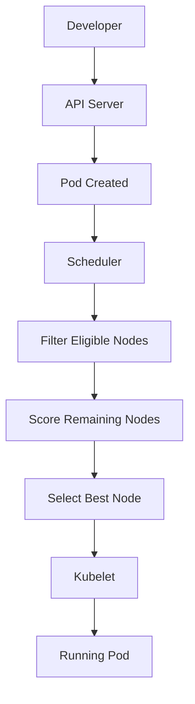

# CKA - Scheduling

> **Goal:** Learn how the Kubernetes Scheduler selects nodes, applies scheduling constraints, and ensures workloads are placed on the most appropriate nodes in a cluster.

---

# 📚 Chapter Contents

* Learning Objectives
* What is Kubernetes Scheduling?
* How the Scheduler Works
* Scheduling Workflow
* nodeSelector
* Node Affinity
* Pod Affinity
* Pod Anti-Affinity
* Taints
* Tolerations
* Priority Classes
* Preemption
* Scheduler Debugging
* Production Decision Tree
* Production Notes
* Best Practices
* Summary
* References

---

# Learning Objectives

After completing this chapter, you should be able to:

* Explain the role of the Kubernetes Scheduler.
* Describe the scheduling workflow.
* Use nodeSelector to schedule Pods.
* Configure Node Affinity rules.
* Configure Pod Affinity and Anti-Affinity.
* Explain Taints and Tolerations.
* Use Priority Classes.
* Explain Kubernetes Preemption.
* Troubleshoot Pods stuck in Pending.
* Answer CKA and Senior DevOps interview questions confidently.

---

# What is Kubernetes Scheduling?

Scheduling is the process of selecting the most appropriate node for a Pod.

When a Pod is created, Kubernetes does not immediately know where it should run.

Instead, the Scheduler evaluates all eligible nodes and chooses the best one based on the Pod's scheduling requirements and the available cluster resources.

---

# How the Scheduler Works

The Kubernetes Scheduler watches for Pods that do not yet have an assigned node.

For every unscheduled Pod it:

1. Finds all eligible nodes.
2. Filters out nodes that do not satisfy scheduling rules.
3. Scores the remaining nodes.
4. Chooses the highest-scoring node.
5. Assigns the Pod to that node.

The kubelet on the selected node then starts the Pod.

---

# Scheduling Workflow



---

# Scheduling Constraints

The Scheduler considers multiple constraints before assigning a Pod to a node.

Examples include:

* CPU availability
* Memory availability
* nodeSelector
* Node Affinity
* Pod Affinity
* Pod Anti-Affinity
* Taints
* Tolerations
* Resource requests
* Priority Classes

---

# nodeSelector

The simplest scheduling mechanism.

A Pod is scheduled only onto nodes with matching labels.

Example:

```yaml
nodeSelector:
  disktype: ssd
```

---

# Node Affinity

Node Affinity provides more flexible scheduling than nodeSelector.

Two common types:

* requiredDuringSchedulingIgnoredDuringExecution
* preferredDuringSchedulingIgnoredDuringExecution

Use Node Affinity when scheduling requirements become more complex.

---

# Pod Affinity

Pod Affinity schedules Pods close to other Pods.

Typical use cases:

* Application and cache together.
* Application and side services together.
* Latency-sensitive workloads.

---

# Pod Anti-Affinity

Pod Anti-Affinity spreads Pods across nodes.

Typical use cases:

* High availability.
* Fault tolerance.
* Even workload distribution.

---

# Taints

Taints protect nodes from unwanted workloads.

They repel Pods unless those Pods explicitly tolerate the taint.

Example:

```bash
kubectl taint nodes worker-1 dedicated=database:NoSchedule
```

---

# Tolerations

A Toleration allows a Pod to be scheduled onto a tainted node.

Important:

A toleration does **not** force scheduling onto a node.

It simply allows scheduling if all other conditions are satisfied.

---

# Priority Classes

Priority Classes determine which Pods receive scheduling preference when cluster resources are limited.

Higher-priority Pods are scheduled before lower-priority Pods.

---

# Preemption

If a high-priority Pod cannot be scheduled because resources are exhausted, Kubernetes may evict lower-priority Pods to free resources.

This behavior is called **Preemption**.

---

# Production Decision Tree

```text
Need to run on a specific node?
        │
        ▼
nodeSelector

Need flexible node selection?
        │
        ▼
Node Affinity

Need Pods close together?
        │
        ▼
Pod Affinity

Need Pods separated across nodes?
        │
        ▼
Pod Anti-Affinity

Need dedicated nodes?
        │
        ▼
Taints + Tolerations

Need critical workloads scheduled first?
        │
        ▼
PriorityClass
```

---

# Production Notes

Common scheduling strategies include:

* GPU workloads on GPU nodes.
* Database workloads on dedicated nodes.
* Logging agents on every node.
* High availability by spreading replicas.
* Dedicated infrastructure nodes.

Always combine scheduling policies with resource requests and limits for predictable placement.

---

# Best Practices

* Use meaningful node labels.
* Prefer Node Affinity over nodeSelector for new workloads.
* Use Pod Anti-Affinity for highly available applications.
* Reserve dedicated nodes with Taints and Tolerations.
* Assign Priority Classes only to critical workloads.
* Investigate scheduling failures before modifying workloads.
* Avoid unnecessary scheduling constraints.

---

# Summary

In this chapter you learned:

* How the Kubernetes Scheduler works.
* How Pods are assigned to nodes.
* The difference between nodeSelector and Node Affinity.
* When to use Pod Affinity and Anti-Affinity.
* How Taints and Tolerations work together.
* How Priority Classes and Preemption influence scheduling.
* How to troubleshoot scheduling failures.

---

# References

* Kubernetes Scheduler Documentation
* Assigning Pods to Nodes
* Taints and Tolerations Documentation
* Node Affinity Documentation
* Pod Affinity Documentation
* Priority and Preemption Documentation
* CKA Curriculum
