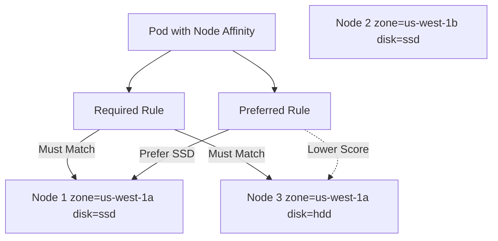

# Node Affinity

```mermaid
flowchart TD
    Pod[Pod with Node Affinity]

    Rule1[Required Rule]
    Rule2[Preferred Rule]

    Node1[Node 1 zone=us-west-1a disk=ssd]
    Node2[Node 2 zone=us-west-1b disk=ssd]
    Node3[Node 3 zone=us-west-1a disk=hdd]

    Pod --> Rule1
    Pod --> Rule2

    Rule1 -->|Must Match| Node1
    Rule1 -->|Must Match| Node3
    Rule2 -->|Prefer SSD| Node1
    Rule2 -.->|Lower Score| Node3
```

## Key Point

Node Affinity supports required and preferred scheduling rules using node labels.
