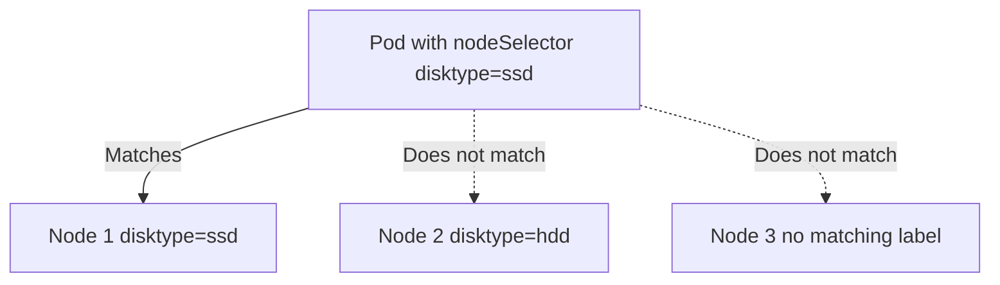

# nodeSelector

```mermaid
flowchart TD
    Pod[Pod with nodeSelector disktype=ssd]
    Node1[Node 1 disktype=ssd]
    Node2[Node 2 disktype=hdd]
    Node3[Node 3 no matching label]

    Pod -->|Matches| Node1
    Pod -.->|Does not match| Node2
    Pod -.->|Does not match| Node3
```

## Key Point

`nodeSelector` schedules Pods only on nodes with exact matching labels.
