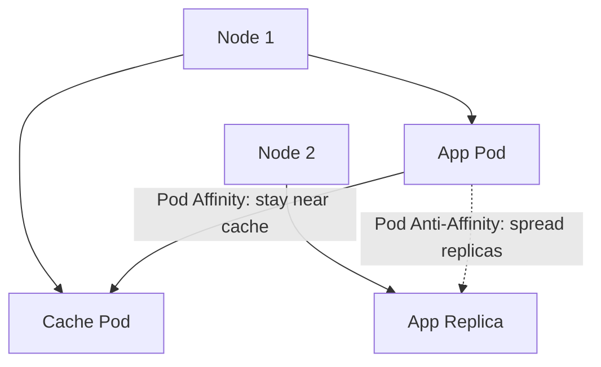

# Pod Affinity and Anti-Affinity

```mermaid
flowchart TD
    Node1[Node 1]
    Node2[Node 2]

    App1[App Pod]
    Cache[Cache Pod]
    App2[App Replica]

    Node1 --> App1
    Node1 --> Cache
    Node2 --> App2

    App1 -->|Pod Affinity: stay near cache| Cache
    App1 -.->|Pod Anti-Affinity: spread replicas| App2
```

## Key Point

Pod Affinity places Pods near other Pods. Pod Anti-Affinity spreads Pods apart.
