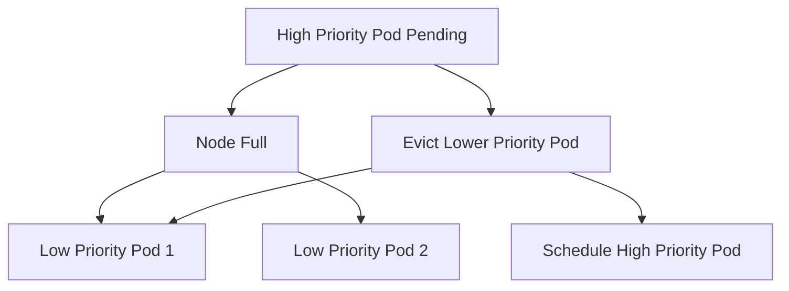

# Preemption

```mermaid
flowchart TD
    High[High Priority Pod Pending]
    Node[Node Full]
    Low1[Low Priority Pod 1]
    Low2[Low Priority Pod 2]
    Evict[Evict Lower Priority Pod]
    Schedule[Schedule High Priority Pod]

    High --> Node
    Node --> Low1
    Node --> Low2
    High --> Evict
    Evict --> Low1
    Evict --> Schedule
```

## Key Point

Preemption allows Kubernetes to evict lower-priority Pods so a higher-priority Pod can be scheduled.
