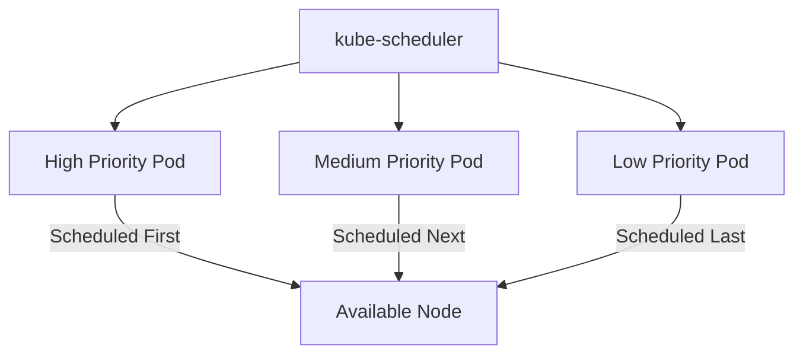

# PriorityClass

```mermaid
flowchart TD
    Scheduler[kube-scheduler]

    High[High Priority Pod]
    Medium[Medium Priority Pod]
    Low[Low Priority Pod]

    Scheduler --> High
    Scheduler --> Medium
    Scheduler --> Low

    High -->|Scheduled First| Node[Available Node]
    Medium -->|Scheduled Next| Node
    Low -->|Scheduled Last| Node
```

## Key Point

PriorityClass gives important Pods higher scheduling priority.
