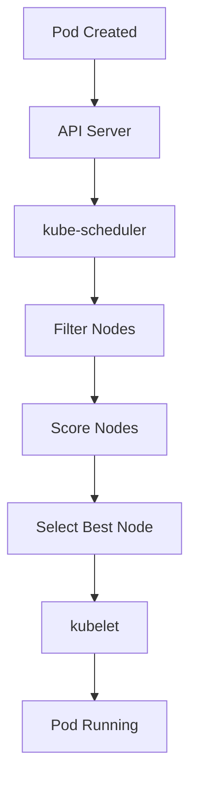

# Scheduler Flow

```mermaid
flowchart TD
    Pod[Pod Created]
    API[API Server]
    Scheduler[kube-scheduler]
    Filter[Filter Nodes]
    Score[Score Nodes]
    Select[Select Best Node]
    Kubelet[kubelet]
    Running[Pod Running]

    Pod --> API
    API --> Scheduler
    Scheduler --> Filter
    Filter --> Score
    Score --> Select
    Select --> Kubelet
    Kubelet --> Running
```

## Key Point

The Scheduler filters nodes, scores eligible nodes, and assigns the Pod to the best node.
