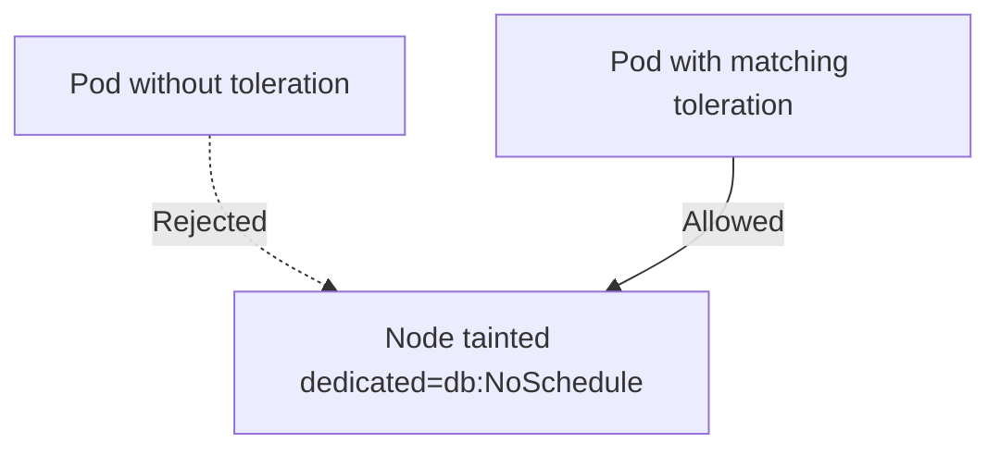

# Taints and Tolerations

```mermaid
flowchart TD
    Node[Node tainted dedicated=db:NoSchedule]

    Pod1[Pod without toleration]
    Pod2[Pod with matching toleration]

    Pod1 -.->|Rejected| Node
    Pod2 -->|Allowed| Node
```

## Key Point

Taints repel Pods. Tolerations allow Pods to be scheduled onto tainted nodes.
