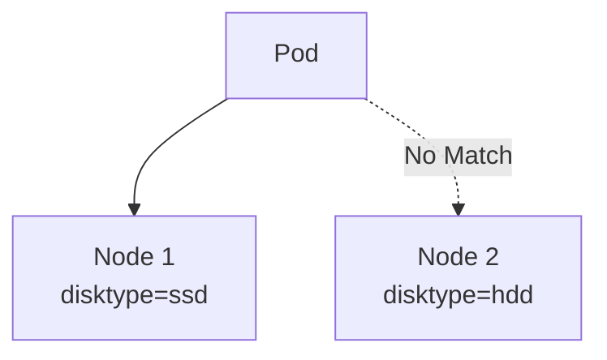

# Lab 01 - nodeSelector

## Difficulty

⭐ Beginner

## Estimated Time

20–30 minutes

---

# CKA Objectives Covered

- Label Nodes
- Use nodeSelector
- Verify Pod placement
- Inspect scheduling decisions

---

# Objective

In this lab, you will:

- Label a node.
- Create a Pod using nodeSelector.
- Verify the Pod is scheduled to the correct node.
- Understand exact label matching.

---

# Architecture



---

# Step 1 - View Existing Nodes

```bash
kubectl get nodes
```

View labels:

```bash
kubectl get nodes --show-labels
```

---

# Step 2 - Add a Label

Choose a node:

```bash
kubectl label node <node-name> disktype=ssd
```

Verify:

```bash
kubectl get nodes --show-labels
```

---

# Step 3 - Create the Pod

Create:

```text
pod.yaml
```

```yaml
apiVersion: v1
kind: Pod

metadata:
  name: nginx-selector

spec:

  nodeSelector:
    disktype: ssd

  containers:

  - name: nginx

    image: nginx
```

---

# Step 4 - Deploy

```bash
kubectl apply -f pod.yaml
```

Verify:

```bash
kubectl get pods -o wide
```

Observe:

The Pod is scheduled onto the node with:

```text
disktype=ssd
```

---

# Step 5 - Describe the Pod

```bash
kubectl describe pod nginx-selector
```

Review:

- Node assignment
- Events
- Scheduling information

---

# Step 6 - Test a Failed Match

Modify:

```yaml
nodeSelector:
  disktype: gold
```

Apply:

```bash
kubectl apply -f pod.yaml
```

Observe:

```bash
kubectl get pods
```

The Pod remains:

```text
Pending
```

Investigate:

```bash
kubectl describe pod nginx-selector
```

Read the Events section to understand why scheduling failed.

---

# Verification Checklist

✅ Node labeled.

✅ Pod scheduled correctly.

✅ Failed scheduling reproduced.

✅ Events reviewed.

---

# Common Errors

## Pod Pending

Check:

```bash
kubectl get nodes --show-labels

kubectl describe pod nginx-selector
```

Most common cause:

The label does not exist on any node.

---

# Production Discussion

Typical nodeSelector use cases:

- GPU nodes
- SSD storage nodes
- ARM vs x86 nodes
- Dedicated hardware

For more complex scheduling, Node Affinity is recommended.

---

# Knowledge Check

1. What is nodeSelector?
2. Does nodeSelector support expressions?
3. What happens if no node matches?
4. Which command shows node labels?
5. Why is Node Affinity preferred for production?

---

# Cleanup

```bash
kubectl delete pod nginx-selector

kubectl label node <node-name> disktype-
```

---

# Challenge

1. Label two different nodes with different values.
2. Create Pods using different nodeSelector values.
3. Verify each Pod is scheduled to the correct node.
4. Remove a label and observe what happens to a newly created Pod.
5. Explain why an already running Pod is not automatically moved.
