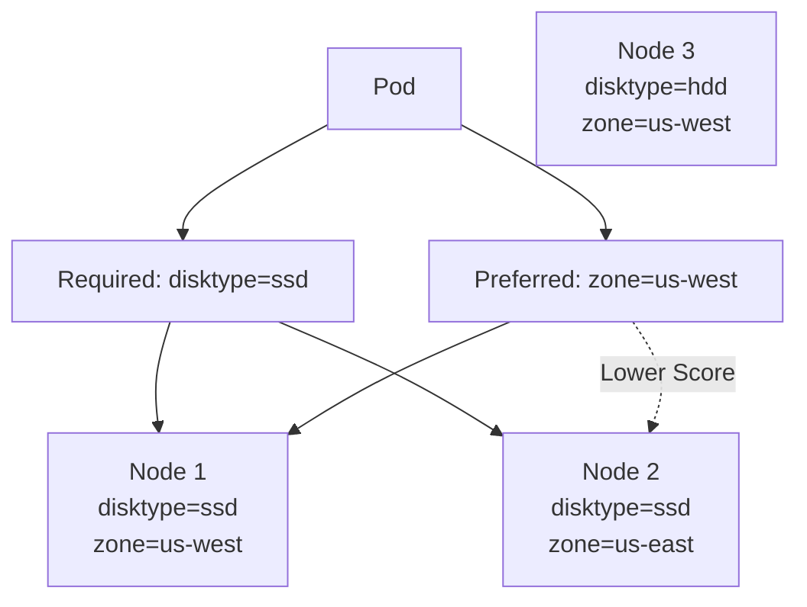

# Lab 02 - Node Affinity

## Difficulty

⭐⭐ Intermediate

## Estimated Time

30–40 minutes

---

# CKA Objectives Covered

* Configure Node Affinity
* Understand required vs preferred rules
* Verify Pod placement
* Troubleshoot affinity failures

---

# Objective

In this lab, you will:

* Create a Pod using Node Affinity.
* Use both required and preferred affinity rules.
* Verify scheduling behavior.
* Compare Node Affinity with nodeSelector.

---

# Architecture



---

# Step 1 - Label Nodes

View labels:

```bash
kubectl get nodes --show-labels
```

Add labels:

```bash
kubectl label node <node1> disktype=ssd
kubectl label node <node1> zone=us-west

kubectl label node <node2> disktype=ssd
kubectl label node <node2> zone=us-east
```

Verify:

```bash
kubectl get nodes --show-labels
```

---

# Step 2 - Create the Pod

Create:

```text
pod-affinity.yaml
```

```yaml
apiVersion: v1
kind: Pod

metadata:
  name: nginx-affinity

spec:

  affinity:

    nodeAffinity:

      requiredDuringSchedulingIgnoredDuringExecution:

        nodeSelectorTerms:

        - matchExpressions:

          - key: disktype

            operator: In

            values:

            - ssd

      preferredDuringSchedulingIgnoredDuringExecution:

      - weight: 100

        preference:

          matchExpressions:

          - key: zone

            operator: In

            values:

            - us-west

  containers:

  - name: nginx

    image: nginx
```

---

# Step 3 - Deploy

```bash
kubectl apply -f pod-affinity.yaml
```

Verify:

```bash
kubectl get pods -o wide
```

Observe:

* Pod must run on a node with `disktype=ssd`.
* Kubernetes prefers a node with `zone=us-west`.

---

# Step 4 - Describe the Pod

```bash
kubectl describe pod nginx-affinity
```

Review:

* Node assignment
* Events
* Scheduling details

---

# Step 5 - Test Required Rule Failure

Modify:

```yaml
values:
- nvme
```

Apply:

```bash
kubectl apply -f pod-affinity.yaml
```

Verify:

```bash
kubectl get pods
```

Expected:

```text
Pending
```

Investigate:

```bash
kubectl describe pod nginx-affinity
```

Observe the scheduling failure message.

---

# Step 6 - Test Preferred Rule

Restore:

```yaml
values:
- ssd
```

Change the preferred zone to one that does not exist:

```yaml
values:
- us-central
```

Apply again.

Observe:

The Pod still schedules because the preferred rule is only a preference, not a requirement.

---

# Verification Checklist

✅ Node labels added.

✅ Required rule verified.

✅ Preferred rule verified.

✅ Failed scheduling reproduced.

✅ Events reviewed.

---

# Common Errors

## Pod Pending

Investigate:

```bash
kubectl describe pod nginx-affinity

kubectl get nodes --show-labels
```

Possible causes:

* Required label missing.
* Incorrect operator.
* Incorrect label value.

---

# Production Discussion

Use Node Affinity for:

* GPU workloads.
* SSD storage nodes.
* Region or zone preferences.
* Dedicated hardware.
* Flexible production scheduling.

Node Affinity is more powerful than nodeSelector because it supports expressions and preferences.

---

# Knowledge Check

1. What is the difference between required and preferred Node Affinity?
2. Which rule prevents scheduling if not satisfied?
3. Does a preferred rule guarantee Pod placement?
4. Why is Node Affinity preferred over nodeSelector?
5. Which operator allows multiple matching values?

---

# Cleanup

```bash
kubectl delete pod nginx-affinity

kubectl label node <node1> disktype-
kubectl label node <node1> zone-

kubectl label node <node2> disktype-
kubectl label node <node2> zone-
```

---

# Challenge

1. Label three nodes with different zones.
2. Configure a required rule for `disktype=ssd`.
3. Configure a preferred rule for `zone=us-west`.
4. Verify where the Pod is scheduled.
5. Change the preferred zone and observe the Scheduler's decision.
6. Explain why the Pod still runs when the preferred rule cannot be satisfied.
