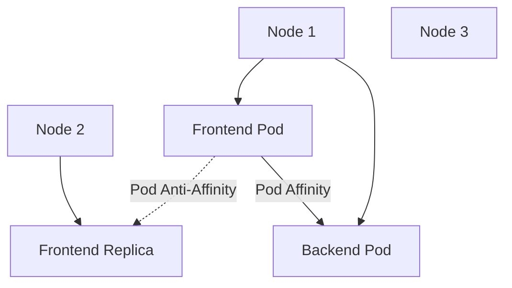

# Lab 03 - Pod Affinity & Pod Anti-Affinity

## Difficulty

⭐⭐⭐ Advanced

## Estimated Time

35–45 minutes

---

# CKA Objectives Covered

* Configure Pod Affinity
* Configure Pod Anti-Affinity
* Verify Pod placement
* Understand topologyKey
* Design highly available applications

---

# Objective

In this lab, you will:

* Create Pods using Pod Affinity.
* Create Pods using Pod Anti-Affinity.
* Observe how Kubernetes schedules Pods based on other Pods.
* Compare Affinity with Anti-Affinity.

---

# Architecture



---

# What is Pod Affinity?

Pod Affinity schedules Pods close to **other Pods**.

Typical production use cases:

* Web application near Redis.
* API near cache.
* Low latency microservices.

---

# What is Pod Anti-Affinity?

Pod Anti-Affinity spreads Pods across different nodes.

Typical production use cases:

* Web replicas
* API replicas
* HA databases
* Multi-zone deployments

---

# Step 1 - Create the Backend Pod

Create:

```text
backend.yaml
```

```yaml
apiVersion: v1
kind: Pod

metadata:
  name: backend

  labels:
    app: backend

spec:

  containers:

  - name: nginx

    image: nginx
```

Deploy:

```bash
kubectl apply -f backend.yaml
```

Verify:

```bash
kubectl get pods -o wide
```

---

# Step 2 - Create Frontend Pod with Pod Affinity

Create:

```text
frontend-affinity.yaml
```

```yaml
apiVersion: v1
kind: Pod

metadata:
  name: frontend

spec:

  affinity:

    podAffinity:

      requiredDuringSchedulingIgnoredDuringExecution:

      - labelSelector:

          matchExpressions:

          - key: app

            operator: In

            values:

            - backend

        topologyKey: kubernetes.io/hostname

  containers:

  - name: nginx

    image: nginx
```

Deploy:

```bash
kubectl apply -f frontend-affinity.yaml
```

Verify:

```bash
kubectl get pods -o wide
```

Observe:

Frontend schedules onto the same node as the backend Pod.

---

# Step 3 - Create Frontend Replica with Anti-Affinity

Create:

```text
frontend-antiaffinity.yaml
```

```yaml
apiVersion: v1
kind: Pod

metadata:
  name: frontend-2

  labels:
    app: frontend

spec:

  affinity:

    podAntiAffinity:

      requiredDuringSchedulingIgnoredDuringExecution:

      - labelSelector:

          matchExpressions:

          - key: app

            operator: In

            values:

            - frontend

        topologyKey: kubernetes.io/hostname

  containers:

  - name: nginx

    image: nginx
```

Deploy:

```bash
kubectl apply -f frontend-antiaffinity.yaml
```

---

# Step 4 - Verify Placement

```bash
kubectl get pods -o wide
```

Observe:

* Backend and Frontend are together.
* Frontend replica is on a different node.

---

# Step 5 - Describe the Pods

```bash
kubectl describe pod frontend

kubectl describe pod frontend-2
```

Review:

* Scheduling events
* Affinity rules
* Assigned nodes

---

# Step 6 - Test Anti-Affinity Failure

If your cluster has only one worker node:

Create another frontend replica:

```yaml
metadata:
  name: frontend-3

labels:
  app: frontend
```

Apply:

```bash
kubectl apply -f frontend-antiaffinity.yaml
```

Observe:

```text
Pending
```

Reason:

Strict Anti-Affinity cannot be satisfied because there is no additional node.

---

# Verification Checklist

✅ Backend created.

✅ Pod Affinity verified.

✅ Pod Anti-Affinity verified.

✅ topologyKey understood.

✅ Scheduling behavior observed.

---

# Common Errors

## Pod Remains Pending

Investigate:

```bash
kubectl describe pod frontend

kubectl describe pod frontend-2

kubectl get pods --show-labels

kubectl get nodes
```

Possible causes:

* Label mismatch.
* topologyKey mismatch.
* Insufficient nodes.
* Required rule cannot be satisfied.

---

# Production Discussion

## Pod Affinity

Use for:

* API + Redis
* API + Cache
* Latency-sensitive workloads

## Pod Anti-Affinity

Use for:

* High Availability
* Replica spreading
* Multi-zone deployments
* Fault tolerance

---

# Knowledge Check

1. What is Pod Affinity?
2. What is Pod Anti-Affinity?
3. What does topologyKey represent?
4. Why might a Pod remain Pending with Anti-Affinity?
5. When should Pod Affinity be avoided?

---

# Cleanup

```bash
kubectl delete pod backend

kubectl delete pod frontend

kubectl delete pod frontend-2
```

If you created `frontend-3`, delete it as well.

---

# Challenge

1. Deploy a backend Pod.
2. Schedule an application Pod using Pod Affinity.
3. Create three frontend replicas with Pod Anti-Affinity.
4. Verify each replica is scheduled on a different node (if available).
5. Reduce the cluster to one node and explain why one or more Pods remain Pending.
6. Explain how Pod Affinity improves latency and how Pod Anti-Affinity improves availability.
