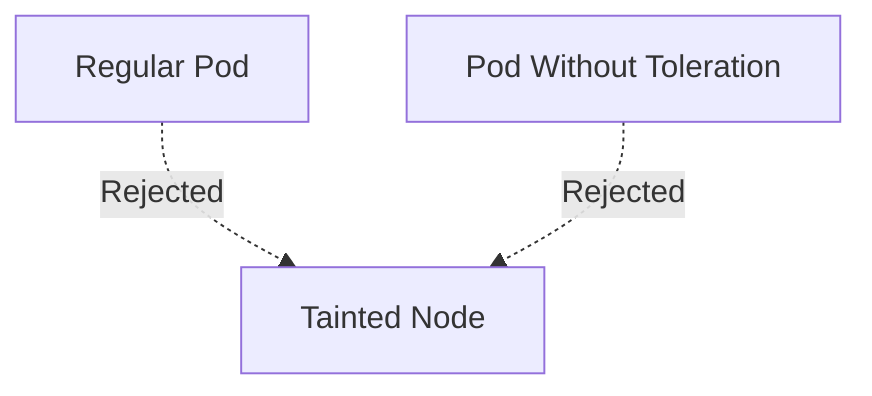

# Lab 04 - Taints

## Difficulty

⭐⭐ Intermediate

## Estimated Time

25–35 minutes

---

# CKA Objectives Covered

* Apply taints to nodes
* Understand NoSchedule, PreferNoSchedule, and NoExecute
* Observe scheduling behavior
* Troubleshoot taint-related scheduling failures

---

# Objective

In this lab, you will:

* Apply different types of taints to a node.
* Observe how taints affect scheduling.
* Understand the three taint effects.
* Verify why Pods remain Pending.

---

# Architecture



---

# What is a Taint?

A taint is applied to a **node**.

It tells Kubernetes:

> "Do not schedule Pods on this node unless they tolerate this taint."

Taints are commonly used to reserve nodes for:

* Databases
* GPU workloads
* Monitoring
* Logging
* Infrastructure services

---

# Step 1 - View Existing Nodes

```bash id="vjx7i9"
kubectl get nodes
```

Choose a node:

```text id="2lj7w2"
worker-1
```

---

# Step 2 - Verify Existing Taints

```bash id="a6thrz"
kubectl describe node worker-1
```

Locate:

```text id="mynb1i"
Taints:
```

Initially:

```text id="woxp59"
<none>
```

---

# Step 3 - Add a NoSchedule Taint

```bash id="5sdr6n"
kubectl taint nodes worker-1 dedicated=db:NoSchedule
```

Verify:

```bash id="85j1fh"
kubectl describe node worker-1
```

Expected:

```text id="n59zbr"
dedicated=db:NoSchedule
```

---

# Step 4 - Create a Pod Without a Toleration

Create:

```text id="lf4d0k"
nginx.yaml
```

```yaml id="qegj2g"
apiVersion: v1
kind: Pod

metadata:
  name: nginx

spec:

  containers:

  - name: nginx

    image: nginx
```

Deploy:

```bash id="tdgcj7"
kubectl apply -f nginx.yaml
```

---

# Step 5 - Verify Scheduling

```bash id="lpby0n"
kubectl get pods
```

If the scheduler selects the tainted node and no other eligible node exists, the Pod remains:

```text id="t6q2mt"
Pending
```

Investigate:

```bash id="o7lr1v"
kubectl describe pod nginx
```

Read the **Events** section.

You should see a message similar to:

```text id="1mcdki"
node(s) had taint {dedicated: db}
```

---

# Step 6 - Test PreferNoSchedule

Remove the previous taint:

```bash id="6nv89k"
kubectl taint nodes worker-1 dedicated=db:NoSchedule-
```

Apply:

```bash id="3l9wef"
kubectl taint nodes worker-1 dedicated=db:PreferNoSchedule
```

Observe:

The Scheduler tries to avoid the node but may still use it if no better option exists.

---

# Step 7 - Test NoExecute

Remove the previous taint:

```bash id="vrcvhg"
kubectl taint nodes worker-1 dedicated=db:PreferNoSchedule-
```

Apply:

```bash id="dhps9r"
kubectl taint nodes worker-1 dedicated=db:NoExecute
```

Observe:

Pods without matching tolerations may be evicted from the node.

---

# Verification Checklist

✅ Node tainted.

✅ NoSchedule behavior observed.

✅ PreferNoSchedule behavior observed.

✅ NoExecute behavior understood.

---

# Common Errors

## Pod Pending

Investigate:

```bash id="fgn5lc"
kubectl describe pod nginx

kubectl describe node worker-1

kubectl get events --sort-by=.lastTimestamp
```

---

## Taint Not Removed

List taints:

```bash id="0pvqf4"
kubectl describe node worker-1
```

Remove:

```bash id="djlwm7"
kubectl taint nodes worker-1 dedicated=db:NoSchedule-
```

Replace `NoSchedule` with the appropriate effect if you applied a different one.

---

# Production Discussion

Use taints for:

* Dedicated database nodes
* GPU nodes
* Monitoring infrastructure
* Logging agents
* Critical platform services

Remember:

A taint **repels** Pods.

It does **not** attract specific workloads.

---

# Knowledge Check

1. What object receives a taint?
2. What is the purpose of a taint?
3. Explain the difference between NoSchedule, PreferNoSchedule, and NoExecute.
4. Does a taint move running Pods automatically?
5. Why are taints commonly used with dedicated infrastructure nodes?

---

# Cleanup

Delete the test Pod:

```bash id="gn2cjo"
kubectl delete pod nginx
```

Remove all taints created during this lab:

```bash id="5pnwq0"
kubectl taint nodes worker-1 dedicated=db:NoSchedule-
kubectl taint nodes worker-1 dedicated=db:PreferNoSchedule-
kubectl taint nodes worker-1 dedicated=db:NoExecute-
```

Verify:

```bash id="sv8ynw"
kubectl describe node worker-1
```

Expected:

```text id="sx9zwn"
Taints: <none>
```

---

# Challenge

1. Apply a `NoSchedule` taint to a node.
2. Create a Pod without a toleration and observe the scheduling result.
3. Change the taint to `PreferNoSchedule` and compare the behavior.
4. Apply a `NoExecute` taint and observe what happens to running Pods.
5. Explain which taint effect you would choose for:

   * Database nodes
   * GPU nodes
   * Temporary maintenance
   * Critical infrastructure
