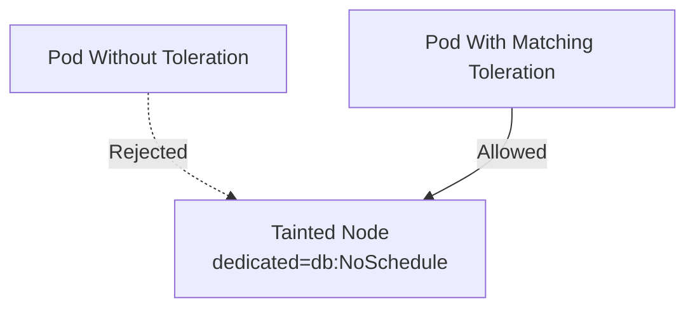

# Lab 05 - Tolerations

## Difficulty

⭐⭐ Intermediate

## Estimated Time

25–35 minutes

---

# CKA Objectives Covered

* Configure Pod tolerations
* Schedule Pods onto tainted nodes
* Verify toleration behavior
* Understand the relationship between taints and tolerations

---

# Objective

In this lab, you will:

* Create a tainted node.
* Deploy a Pod with a matching toleration.
* Verify successful scheduling.
* Compare Pods with and without tolerations.

---

# Architecture



---

# Prerequisites

Ensure the test node has no existing taints:

```bash id="j9l4sv"
kubectl describe node worker-1
```

---

# Step 1 - Add a Taint

Apply:

```bash id="f6b0ua"
kubectl taint nodes worker-1 dedicated=db:NoSchedule
```

Verify:

```bash id="zj57lt"
kubectl describe node worker-1
```

Expected:

```text id="q4w1hr"
dedicated=db:NoSchedule
```

---

# Step 2 - Create a Pod Without a Toleration

Create:

```text id="8s91h3"
pod-no-toleration.yaml
```

```yaml id="7xbl8o"
apiVersion: v1
kind: Pod

metadata:
  name: nginx-no-toleration

spec:

  containers:

  - name: nginx

    image: nginx
```

Deploy:

```bash id="j2l8on"
kubectl apply -f pod-no-toleration.yaml
```

Verify:

```bash id="h8g57y"
kubectl describe pod nginx-no-toleration
```

Observe the scheduling failure if the tainted node is the only eligible node.

---

# Step 3 - Create a Pod With a Toleration

Create:

```text id="pv4b7x"
pod-with-toleration.yaml
```

```yaml id="81btx6"
apiVersion: v1
kind: Pod

metadata:
  name: nginx-with-toleration

spec:

  tolerations:

  - key: dedicated

    operator: Equal

    value: db

    effect: NoSchedule

  containers:

  - name: nginx

    image: nginx
```

Deploy:

```bash id="4w8n7l"
kubectl apply -f pod-with-toleration.yaml
```

---

# Step 4 - Verify Scheduling

```bash id="5r4xtv"
kubectl get pods -o wide
```

Observe:

* Pod without toleration remains Pending (if no alternative node exists).
* Pod with toleration is eligible to run on the tainted node.

---

# Step 5 - Describe the Pod

```bash id="2kg1ey"
kubectl describe pod nginx-with-toleration
```

Review:

* Tolerations
* Assigned node
* Events

---

# Step 6 - Verify the Toleration

View the Pod YAML:

```bash id="kt9vmd"
kubectl get pod nginx-with-toleration -o yaml
```

Locate:

```yaml id="fyzux2"
tolerations:
```

Confirm it matches the node's taint.

---

# Step 7 - Test an Incorrect Toleration

Modify:

```yaml id="oaq75j"
value: gpu
```

Apply:

```bash id="g33uwv"
kubectl apply -f pod-with-toleration.yaml
```

Observe:

The Pod is no longer eligible for the tainted node.

Review:

```bash id="mxt86j"
kubectl describe pod nginx-with-toleration
```

---

# Verification Checklist

✅ Taint applied.

✅ Pod without toleration tested.

✅ Pod with matching toleration scheduled.

✅ Incorrect toleration tested.

---

# Common Errors

## Pod Still Pending

Investigate:

```bash id="ixhbhm"
kubectl describe pod nginx-with-toleration

kubectl describe node worker-1

kubectl get events --sort-by=.lastTimestamp
```

Possible causes:

* Incorrect key
* Incorrect value
* Wrong effect
* Additional scheduling constraints
* Resource shortage

---

# Production Discussion

Common use cases:

* GPU workloads
* Database clusters
* Monitoring agents
* Logging agents
* Infrastructure services

Taints and tolerations help isolate workloads while still allowing approved Pods onto dedicated nodes.

---

# Knowledge Check

1. What is a toleration?
2. Does a toleration force scheduling?
3. What must match between a taint and a toleration?
4. Can a Pod have multiple tolerations?
5. Why are tolerations commonly used with infrastructure workloads?

---

# Cleanup

Delete the Pods:

```bash id="jl3tqo"
kubectl delete pod nginx-no-toleration

kubectl delete pod nginx-with-toleration
```

Remove the taint:

```bash id="h31lq8"
kubectl taint nodes worker-1 dedicated=db:NoSchedule-
```

Verify:

```bash id="7b9r2u"
kubectl describe node worker-1
```

Expected:

```text id="57fj9k"
Taints: <none>
```

---

# Challenge

1. Apply a `NoSchedule` taint to a node.
2. Create one Pod without a toleration.
3. Create another Pod with a matching toleration.
4. Compare the scheduling results.
5. Modify the toleration value and observe the behavior.
6. Explain why a toleration allows scheduling but does not guarantee the Pod will run on the tainted node.
