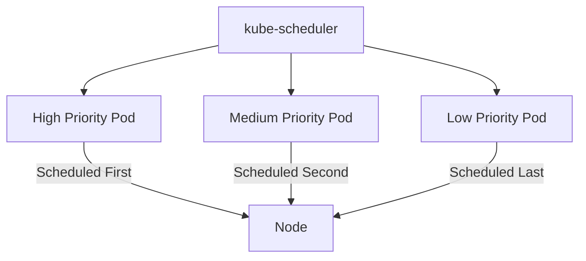

# Lab 06 - PriorityClass

## Difficulty

⭐⭐⭐ Advanced

## Estimated Time

30–40 minutes

---

# CKA Objectives Covered

* Create PriorityClasses
* Assign priorities to Pods
* Verify scheduling order
* Understand scheduling precedence

---

# Objective

In this lab, you will:

* Create a custom PriorityClass.
* Deploy Pods with different priorities.
* Observe scheduling precedence.
* Understand how PriorityClass influences the Scheduler.

---

# Architecture



---

# What is a PriorityClass?

PriorityClass assigns an integer priority to Pods.

When cluster resources are limited:

* Higher priority Pods are scheduled first.
* Lower priority Pods wait or may later be preempted.

PriorityClass affects scheduling order but does **not** reserve resources.

---

# Production Use Cases

PriorityClass is commonly used for:

* CoreDNS
* Metrics Server
* Ingress Controllers
* Monitoring
* Logging
* Critical infrastructure
* Platform services

---

# Step 1 - Create a PriorityClass

Create:

```text
high-priority.yaml
```

```yaml
apiVersion: scheduling.k8s.io/v1
kind: PriorityClass

metadata:
  name: high-priority

value: 100000

globalDefault: false

description: "High priority for critical workloads."
```

Deploy:

```bash
kubectl apply -f high-priority.yaml
```

Verify:

```bash
kubectl get priorityclass
```

---

# Step 2 - Create a High Priority Pod

Create:

```text
high-priority-pod.yaml
```

```yaml
apiVersion: v1
kind: Pod

metadata:
  name: nginx-high

spec:

  priorityClassName: high-priority

  containers:

  - name: nginx

    image: nginx
```

Deploy:

```bash
kubectl apply -f high-priority-pod.yaml
```

Verify:

```bash
kubectl get pods
```

---

# Step 3 - Create a Normal Priority Pod

Create:

```text
normal-pod.yaml
```

```yaml
apiVersion: v1
kind: Pod

metadata:
  name: nginx-normal

spec:

  containers:

  - name: nginx

    image: nginx
```

Deploy:

```bash
kubectl apply -f normal-pod.yaml
```

---

# Step 4 - Verify Priority

Describe the high-priority Pod:

```bash
kubectl describe pod nginx-high
```

Observe:

```text
Priority Class Name:

high-priority
```

Describe the normal Pod:

```bash
kubectl describe pod nginx-normal
```

Observe:

The default PriorityClass is used unless another one is specified.

---

# Step 5 - List PriorityClasses

```bash
kubectl get priorityclass
```

Describe:

```bash
kubectl describe priorityclass high-priority
```

Observe:

* Value
* Global default
* Description

---

# Step 6 - Understand Scheduling Order

If cluster resources become constrained:

1. Higher-priority Pods are scheduled first.
2. Lower-priority Pods may remain Pending.
3. In extreme cases, lower-priority Pods may later be preempted (covered in the next lab).

---

# Verification Checklist

✅ PriorityClass created.

✅ Pod assigned a PriorityClass.

✅ Default priority compared.

✅ Scheduling order understood.

---

# Common Errors

## PriorityClass Not Found

Investigate:

```bash
kubectl get priorityclass
```

Ensure:

```yaml
priorityClassName:
```

matches the PriorityClass name exactly.

---

## Priority Has No Visible Effect

PriorityClass only matters when scheduling decisions are required.

If sufficient resources are available, Pods of different priorities may all schedule successfully.

---

# Production Discussion

Use PriorityClasses for:

* DNS
* Ingress
* Monitoring
* Logging
* Security agents
* Platform services

Avoid assigning high priorities to every workload, or the priority system loses its value.

---

# Knowledge Check

1. What is a PriorityClass?
2. Does PriorityClass reserve resources?
3. What field assigns a PriorityClass to a Pod?
4. When does PriorityClass become important?
5. Name three workloads that commonly use a high PriorityClass.

---

# Cleanup

Delete the Pods:

```bash
kubectl delete pod nginx-high

kubectl delete pod nginx-normal
```

Delete the PriorityClass:

```bash
kubectl delete priorityclass high-priority
```

Verify:

```bash
kubectl get priorityclass
```

---

# Challenge

1. Create two custom PriorityClasses with different values.
2. Deploy Pods using each PriorityClass.
3. Compare the Pod descriptions.
4. Explain why both Pods may still run if sufficient resources are available.
5. Explain how PriorityClass differs from resource requests and limits.
