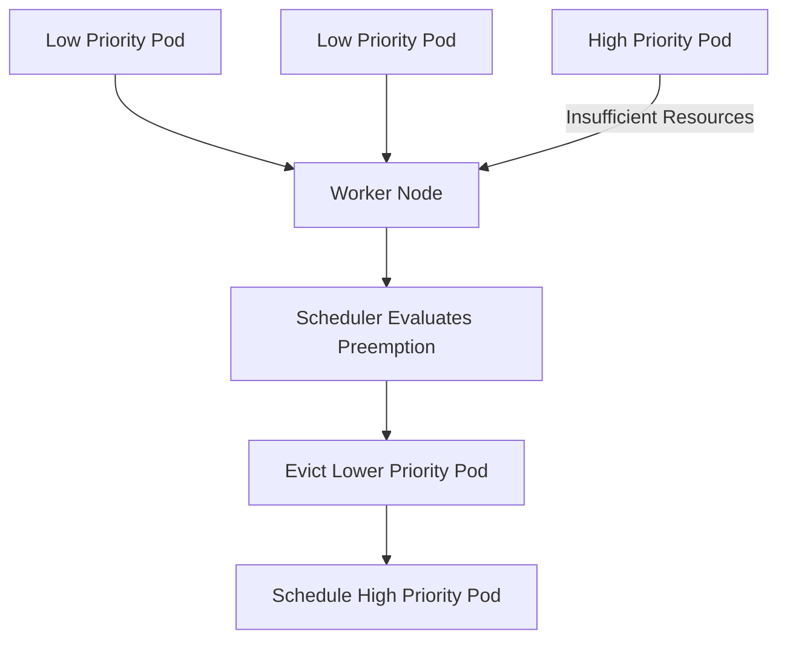

# Lab 07 - Preemption

## Difficulty

⭐⭐⭐⭐ Advanced

## Estimated Time

35–45 minutes

---

# CKA Objectives Covered

* Understand Kubernetes Preemption
* Observe scheduling under resource pressure
* Explain the relationship between PriorityClass and Preemption
* Troubleshoot preemption-related scheduling decisions

---

# Objective

In this lab, you will:

* Create multiple PriorityClasses.
* Deploy workloads with different priorities.
* Understand when preemption occurs.
* Learn why preemption does not always happen.

---

# Architecture



---

# What is Preemption?

Preemption allows Kubernetes to evict one or more lower-priority Pods so that a higher-priority Pod can be scheduled.

Preemption only occurs when:

* A higher-priority Pod cannot be scheduled.
* Evicting lower-priority Pods would free sufficient resources.
* No other eligible node exists.

---

# Production Examples

Preemption may occur for:

* CoreDNS
* Monitoring
* Ingress Controllers
* Critical platform services
* Emergency operational workloads

---

# Step 1 - Create Two PriorityClasses

Create:

```text id="xpn5ow"
priorityclasses.yaml
```

```yaml id="o5k4hp"
apiVersion: scheduling.k8s.io/v1
kind: PriorityClass
metadata:
  name: low-priority
value: 1000
globalDefault: false
description: "Low priority workloads."
---
apiVersion: scheduling.k8s.io/v1
kind: PriorityClass
metadata:
  name: high-priority
value: 100000
globalDefault: false
description: "Critical workloads."
```

Apply:

```bash id="q9bqxu"
kubectl apply -f priorityclasses.yaml
```

Verify:

```bash id="0lfrcp"
kubectl get priorityclass
```

---

# Step 2 - Create a Low Priority Pod

Create:

```text id="gukcfc"
low-priority-pod.yaml
```

```yaml id="9lf53d"
apiVersion: v1
kind: Pod

metadata:
  name: low-priority-pod

spec:

  priorityClassName: low-priority

  containers:

  - name: nginx

    image: nginx

    resources:
      requests:
        cpu: "500m"
        memory: "256Mi"
```

Deploy:

```bash id="4n5sbs"
kubectl apply -f low-priority-pod.yaml
```

---

# Step 3 - Create a High Priority Pod

Create:

```text id="gwsh3z"
high-priority-pod.yaml
```

```yaml id="1m9wxw"
apiVersion: v1
kind: Pod

metadata:
  name: high-priority-pod

spec:

  priorityClassName: high-priority

  containers:

  - name: nginx

    image: nginx

    resources:
      requests:
        cpu: "500m"
        memory: "256Mi"
```

Deploy:

```bash id="5s3bqs"
kubectl apply -f high-priority-pod.yaml
```

---

# Step 4 - Observe Scheduling

Most local clusters (Kind, Minikube, Docker Desktop) have enough free resources.

Both Pods will likely schedule successfully.

This is expected.

The purpose of this lab is to understand **how preemption works**, not necessarily to trigger it.

---

# Step 5 - Inspect the Pods

```bash id="ygo78r"
kubectl get pods

kubectl describe pod high-priority-pod

kubectl describe pod low-priority-pod
```

Observe:

* PriorityClassName
* Priority value
* Scheduling events

---

# Step 6 - Inspect PriorityClasses

```bash id="i04zkt"
kubectl describe priorityclass high-priority

kubectl describe priorityclass low-priority
```

---

# Step 7 - Understand When Preemption Happens

Preemption requires:

* Cluster resource exhaustion.
* A higher-priority Pod waiting in Pending.
* Lower-priority Pods consuming the required resources.

Without these conditions, Kubernetes does **not** preempt Pods.

---

# Verification Checklist

✅ Multiple PriorityClasses created.

✅ Pods assigned different priorities.

✅ Priority verified.

✅ Preemption conditions understood.

---

# Common Errors

## Preemption Never Happens

This is normal in small lab environments.

Most clusters have sufficient resources.

Use:

```bash id="63j1do"
kubectl describe pod high-priority-pod
```

Review scheduling events.

---

## PriorityClass Not Found

Verify:

```bash id="rjlwm7"
kubectl get priorityclass
```

Ensure the Pod references the correct PriorityClass name.

---

# Production Discussion

Use preemption carefully.

It is intended for:

* Critical infrastructure
* Cluster recovery
* Essential platform services

Avoid designing workloads that rely on frequent preemption.

---

# Knowledge Check

1. What is Kubernetes Preemption?
2. Does every high-priority Pod trigger preemption?
3. What conditions are required before preemption occurs?
4. How is Preemption related to PriorityClass?
5. Why is preemption uncommon in small lab clusters?

---

# Cleanup

Delete the Pods:

```bash id="sz6vn0"
kubectl delete pod high-priority-pod

kubectl delete pod low-priority-pod
```

Delete the PriorityClasses:

```bash id="x5n6w5"
kubectl delete priorityclass high-priority

kubectl delete priorityclass low-priority
```

---

# Challenge

1. Create two PriorityClasses.
2. Deploy Pods using each PriorityClass.
3. Describe both Pods.
4. Explain why both Pods can run simultaneously.
5. Describe the exact conditions required for Kubernetes to perform preemption.
6. Explain why preemption should be used only for critical workloads.
