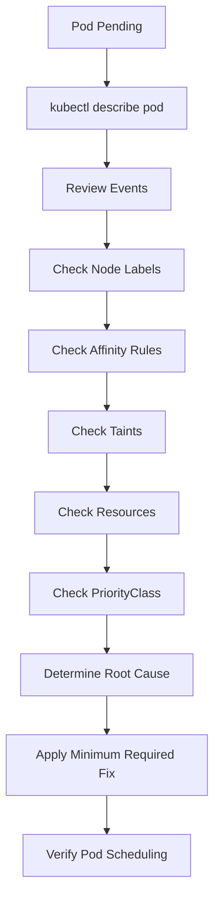

# Lab 08 - Scheduler Debugging (Capstone)

## Difficulty

⭐⭐⭐⭐⭐ Expert

## Estimated Time

60–75 minutes

---

# CKA Objectives Covered

* Troubleshoot scheduling failures
* Analyze Events
* Diagnose Pending Pods
* Verify labels, affinity, taints, and tolerations
* Apply a structured debugging workflow

---

# Objective

In this lab, you will:

* Troubleshoot common scheduling problems.
* Follow a production-ready debugging workflow.
* Identify root causes.
* Recommend appropriate fixes.
* Verify successful scheduling after remediation.

---

# Production Troubleshooting Workflow

Always investigate in this order:



---

# Scenario 1 - nodeSelector Mismatch

## Symptoms

```text
STATUS

Pending
```

### Investigation

```bash
kubectl describe pod <pod-name>

kubectl get nodes --show-labels
```

### Root Cause

The required node label does not exist.

### Resolution

* Add the correct label to a node.
* Update the nodeSelector.
* Redeploy the Pod if necessary.

---

# Scenario 2 - Node Affinity Failure

## Symptoms

```text
FailedScheduling
```

### Investigation

```bash
kubectl describe pod <pod-name>

kubectl get nodes --show-labels

kubectl get pod <pod-name> -o yaml
```

### Root Cause

The required affinity rule cannot be satisfied.

### Resolution

* Correct the node labels.
* Relax the affinity rule if appropriate.
* Verify operators and values.

---

# Scenario 3 - Pod Affinity Failure

## Symptoms

The Pod remains Pending even though nodes are available.

### Investigation

```bash
kubectl describe pod <pod-name>

kubectl get pods --show-labels

kubectl get pods -o wide
```

### Root Cause

The referenced Pod does not exist or its labels do not match.

### Resolution

Ensure the target Pod exists and has the expected labels.

---

# Scenario 4 - Pod Anti-Affinity Failure

## Symptoms

Replicas remain Pending.

### Investigation

```bash
kubectl describe pod <pod-name>

kubectl get nodes

kubectl get pods -o wide
```

### Root Cause

The cluster does not have enough nodes to satisfy the Anti-Affinity rule.

### Resolution

* Add more nodes.
* Use preferred Anti-Affinity if appropriate.
* Reduce the replica count.

---

# Scenario 5 - Taints Without Tolerations

## Symptoms

Events show:

```text
node(s) had taint
```

### Investigation

```bash
kubectl describe node <node>

kubectl describe pod <pod-name>
```

### Resolution

* Add a matching toleration.
* Remove the taint if it is no longer required.

---

# Scenario 6 - Resource Exhaustion

## Symptoms

```text
Insufficient cpu

Insufficient memory
```

### Investigation

```bash
kubectl describe pod <pod-name>

kubectl describe node <node>
```

### Resolution

* Reduce resource requests.
* Add cluster capacity.
* Free unused resources.

---

# Scenario 7 - PriorityClass

## Symptoms

High-priority Pod remains Pending.

### Investigation

```bash
kubectl describe pod <pod-name>

kubectl get priorityclass

kubectl get events
```

### Root Cause

Resources are unavailable or preemption cannot resolve the scheduling conflict.

---

# Scenario 8 - Node NotReady

## Symptoms

Scheduler ignores one or more nodes.

### Investigation

```bash
kubectl get nodes

kubectl describe node <node>
```

### Resolution

Restore node health before expecting new workloads to schedule.

---

# Scenario 9 - Multiple Scheduling Constraints

## Symptoms

Pod remains Pending.

### Investigation

Review:

* nodeSelector
* Node Affinity
* Pod Affinity
* Pod Anti-Affinity
* Taints
* Tolerations
* Resource requests

### Root Cause

No node satisfies all scheduling requirements simultaneously.

### Resolution

Simplify or correct the scheduling rules.

---

# Production Debugging Checklist

Always verify:

### Pod

```bash
kubectl describe pod <pod-name>
```

---

### Events

```bash
kubectl get events --sort-by=.lastTimestamp
```

---

### Nodes

```bash
kubectl get nodes

kubectl describe node <node>
```

---

### Labels

```bash
kubectl get nodes --show-labels
```

---

### Pod Placement

```bash
kubectl get pods -o wide
```

---

### Affinity

```bash
kubectl get pod <pod-name> -o yaml
```

---

### Taints

```bash
kubectl describe node <node>
```

---

### PriorityClasses

```bash
kubectl get priorityclass
```

---

# Common Scheduling Events

| Event                              | Meaning                           |
| ---------------------------------- | --------------------------------- |
| FailedScheduling                   | Scheduler could not place the Pod |
| node(s) didn't match node selector | Missing or incorrect node label   |
| node(s) had taint                  | Missing toleration                |
| NodeAffinity                       | Affinity rule not satisfied       |
| Insufficient cpu                   | CPU unavailable                   |
| Insufficient memory                | Memory unavailable                |
| NodeNotReady                       | Node unavailable for scheduling   |

---

# Production Tips

* Read Events before changing manifests.
* Verify labels before troubleshooting nodeSelector.
* Keep affinity rules as simple as possible.
* Reserve dedicated nodes using Taints and Tolerations.
* Avoid unnecessary scheduling constraints.
* Monitor cluster capacity proactively.
* Use PriorityClasses only for critical workloads.

---

# Final Challenge

A Pod has been in **Pending** for 20 minutes.

Without using notes:

1. Describe your troubleshooting workflow.
2. List the first five commands you would run.
3. Explain what each command tells you.
4. Identify possible scheduling constraints.
5. Determine the root cause.
6. Apply the minimum required fix.
7. Verify the Pod schedules successfully.
8. Explain how you would prevent the issue from happening again.

---

# Cleanup

Delete any resources created during this chapter:

```bash
kubectl delete pod --all

kubectl delete priorityclass --all
```

If you added test labels or taints:

```bash
kubectl label node <node-name> disktype-

kubectl label node <node-name> zone-

kubectl taint nodes <node-name> dedicated=db:NoSchedule-

kubectl taint nodes <node-name> dedicated=db:PreferNoSchedule-

kubectl taint nodes <node-name> dedicated=db:NoExecute-
```

Verify:

```bash
kubectl get pods

kubectl get priorityclass

kubectl get nodes --show-labels
```
