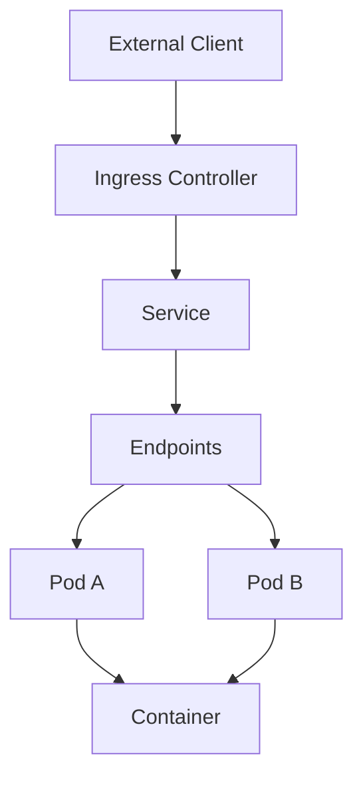

# CKA - Services & Networking

> **Goal:** Learn how applications communicate inside and outside a Kubernetes cluster using Services, DNS, Ingress, and Network Policies.

---

# 📚 Chapter Contents

* Learning Objectives
* Why Services Exist
* Kubernetes Networking Fundamentals
* Traffic Flow
* Service Types
* ClusterIP
* NodePort
* LoadBalancer
* ExternalName
* Endpoints
* EndpointSlice
* DNS
* CoreDNS
* Ingress
* Network Policies
* Production Decision Tree
* Best Practices
* Summary
* References

---

# Learning Objectives

After completing this chapter, you should be able to:

* Explain why Kubernetes Services are required.
* Describe the Kubernetes networking model.
* Differentiate between ClusterIP, NodePort, LoadBalancer, and ExternalName.
* Explain how Services discover Pods.
* Understand Endpoints and EndpointSlices.
* Troubleshoot Service connectivity issues.
* Explain Kubernetes DNS and CoreDNS.
* Configure Ingress resources.
* Apply Network Policies.
* Answer CKA and Senior DevOps interview questions confidently.

---

# Why Services Exist

Pods are **ephemeral**.

They can be:

* Created
* Deleted
* Rescheduled
* Recreated with a different IP address

If applications connected directly to Pod IPs, communication would frequently break.

**Services provide a stable network identity** that survives Pod recreation.

---

# Kubernetes Networking Fundamentals

Kubernetes networking is built on these principles:

* Every Pod receives its own IP address.
* Pods can communicate directly with other Pods (without NAT).
* Nodes can communicate with every Pod.
* Services provide stable virtual IPs.
* DNS allows applications to discover Services by name.

---

# Traffic Flow

A typical request flows through the cluster as follows:

```text id="9vtywe"
Client
   │
   ▼
Ingress
   │
   ▼
Service
   │
   ▼
Endpoint / EndpointSlice
   │
   ▼
Pod
   │
   ▼
Container
```

For internal traffic, Ingress is not involved:

```text id="lmsvzz"
Application
      │
      ▼
ClusterIP Service
      │
      ▼
Endpoint
      │
      ▼
Pod
```

---

# Kubernetes Networking Model



---

# Service Types

Kubernetes supports four primary Service types:

| Service Type | Purpose                                        |
| ------------ | ---------------------------------------------- |
| ClusterIP    | Internal communication within the cluster      |
| NodePort     | Expose a Service on a node port                |
| LoadBalancer | Expose a Service through a cloud load balancer |
| ExternalName | Map a Service to an external DNS name          |

---

# ClusterIP

The default Service type.

Characteristics:

* Internal only
* Stable virtual IP
* Accessible only from inside the cluster

Typical use cases:

* Backend APIs
* Databases
* Internal microservices

---

# NodePort

Exposes a Service on a static port on every node.

Traffic flow:

```text id="0omgyu"
Client

↓

NodeIP:NodePort

↓

Service

↓

Pod
```

Typical use cases:

* Development
* Testing
* Small clusters
* Home labs

---

# LoadBalancer

Creates an external load balancer through the cloud provider.

Traffic flow:

```text id="r72h1w"
Internet

↓

Cloud Load Balancer

↓

Service

↓

Pods
```

Typical use cases:

* Production applications
* Public APIs
* External websites

---

# ExternalName

Does not create a proxy.

Instead, it maps a Kubernetes Service name to an external DNS name.

Example:

```yaml id="9w31sl"
type: ExternalName

externalName: api.example.com
```

Typical use cases:

* External databases
* Third-party APIs
* Legacy systems

---

# Endpoints

Endpoints represent the Pods backing a Service.

When Pods are added or removed, Kubernetes automatically updates the Endpoints object.

Example:

```text id="l9jrqg"
Service

↓

Endpoints

↓

Pod A

Pod B

Pod C
```

---

# EndpointSlice

EndpointSlice is the modern replacement for large Endpoints objects.

Benefits:

* Better scalability
* Improved performance
* Reduced API load
* Efficient updates for large clusters

---

# DNS

Every Service automatically receives a DNS name.

Example:

```text id="jh4kpn"
backend.default.svc.cluster.local
```

Applications usually use the short name:

```text id="hup7w0"
backend
```

CoreDNS resolves the name to the Service IP.

---

# CoreDNS

CoreDNS is the default DNS server in Kubernetes.

Responsibilities:

* Resolve Service names
* Resolve Pod names (where applicable)
* Cache DNS records
* Forward external DNS queries

Without CoreDNS, Service discovery by name would not work.

---

# Ingress

Ingress provides HTTP and HTTPS routing into the cluster.

Typical capabilities:

* Host-based routing
* Path-based routing
* TLS termination
* Multiple applications behind one IP

Example:

```text id="f6m4nx"
example.com/api

↓

Ingress

↓

API Service
```

---

# Network Policies

Network Policies control which Pods are allowed to communicate.

Without Network Policies:

```text id="q7mfjlwm"
All Pods can communicate.
```

With Network Policies:

* Allow specific traffic
* Deny unwanted traffic
* Restrict namespace communication
* Improve security

---

# Production Decision Tree

```text id="i0zv9r"
Need internal communication?
        │
        ▼
ClusterIP

Need quick external access?
        │
        ▼
NodePort

Need production external access?
        │
        ▼
LoadBalancer

Need to access an external DNS service?
        │
        ▼
ExternalName

Need HTTP/HTTPS routing?
        │
        ▼
Ingress

Need network security?
        │
        ▼
NetworkPolicy
```

---

# Best Practices

* Use ClusterIP for internal services.
* Avoid exposing NodePort directly in production.
* Prefer Ingress for HTTP and HTTPS applications.
* Use LoadBalancer for public-facing services.
* Implement Network Policies to restrict traffic.
* Use DNS names instead of Pod IP addresses.
* Monitor Endpoints and EndpointSlices during troubleshooting.
* Keep Services selector labels simple and consistent.

---

# Summary

In this chapter you learned:

* Why Services exist.
* How traffic flows through Kubernetes.
* The four Service types.
* The role of Endpoints and EndpointSlices.
* How DNS and CoreDNS enable Service discovery.
* How Ingress exposes applications.
* How Network Policies secure communication.

---

# References

* Kubernetes Services Documentation
* Kubernetes DNS Documentation
* CoreDNS Documentation
* Ingress Documentation
* Network Policies Documentation
* EndpointSlice Documentation
* CKA Curriculum
