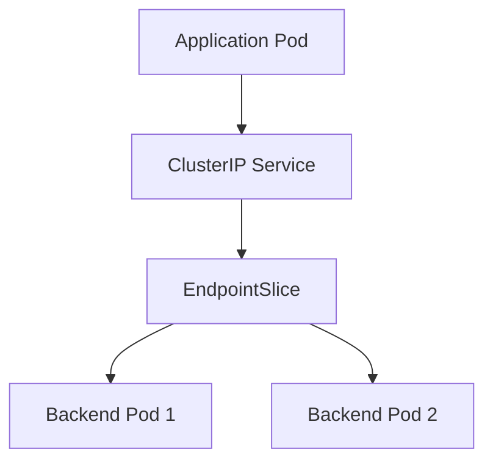

# ClusterIP

```mermaid
flowchart TD
    App[Application Pod]
    Service[ClusterIP Service]
    EndpointSlice[EndpointSlice]
    Pod1[Backend Pod 1]
    Pod2[Backend Pod 2]

    App --> Service
    Service --> EndpointSlice
    EndpointSlice --> Pod1
    EndpointSlice --> Pod2
```

## Key Point

ClusterIP Services are accessible only inside the cluster.
