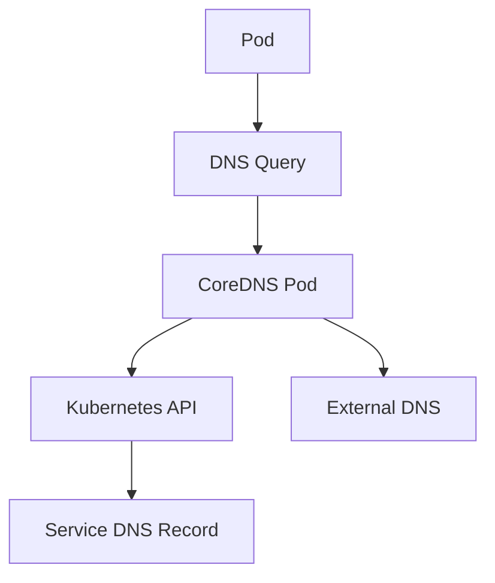

# CoreDNS

```mermaid
flowchart TD
    Pod[Pod]
    DNSQuery[DNS Query]
    CoreDNS[CoreDNS Pod]
    KubernetesAPI[Kubernetes API]
    ServiceRecord[Service DNS Record]
    ExternalDNS[External DNS]

    Pod --> DNSQuery
    DNSQuery --> CoreDNS
    CoreDNS --> KubernetesAPI
    KubernetesAPI --> ServiceRecord
    CoreDNS --> ExternalDNS
```

## Key Point

CoreDNS resolves Kubernetes Service names and forwards external DNS queries.
