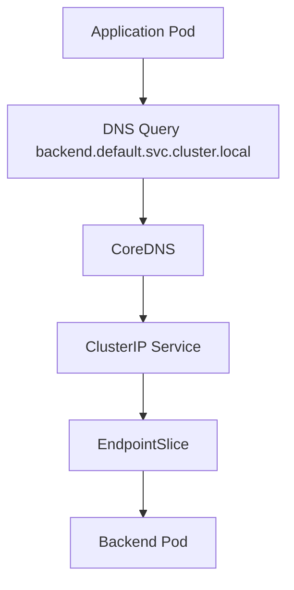

# Kubernetes DNS

```mermaid
flowchart TD
    Pod[Application Pod]
    Query[DNS Query backend.default.svc.cluster.local]
    CoreDNS[CoreDNS]
    Service[ClusterIP Service]
    EndpointSlice[EndpointSlice]
    Backend[Backend Pod]

    Pod --> Query
    Query --> CoreDNS
    CoreDNS --> Service
    Service --> EndpointSlice
    EndpointSlice --> Backend
```

## Key Point

CoreDNS resolves Service names to Service IPs.
